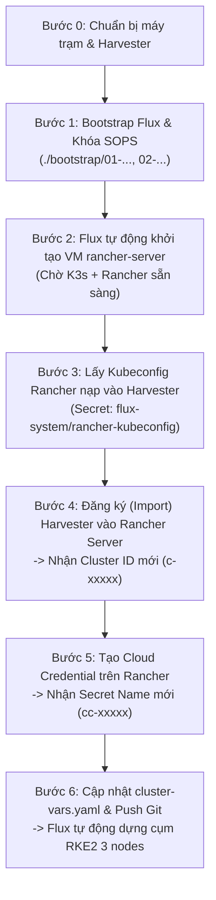

# Hướng Dẫn Cài Đặt Mới & Khôi Phục Toàn Diện (Fresh Install & Disaster Recovery)

Tài liệu này hướng dẫn chi tiết quy trình chuẩn để triển khai mới từ đầu (**Fresh Bootstrap**) hoặc khôi phục thảm họa toàn diện (**Disaster Recovery**) khi toàn bộ máy ảo (bao gồm cả máy ảo quản trị `rancher-server` và các máy ảo worker/controlplane của cụm RKE2 downstream) bị xóa sạch hoặc khi cài đặt trên một cụm Harvester hoàn toàn mới.

---

## 1. Phân Biệt Hai Cấp Độ Khôi Phục

| Cấp độ | Phạm vi sự cố | Hành động cần làm | Thời gian phục hồi |
| :--- | :--- | :--- | :---: |
| **Cấp độ 1: Tự Phục Hồi Node RKE2** *(Rancher Server còn sống)* | Chỉ các máy ảo downstream `rke2-lab-cp-*` hoặc `rke2-lab-wk-*` bị xóa hoặc hỏng. | **Không cần can thiệp thủ công**. Flux và Rancher Node Driver sẽ tự động đối chiếu GitOps và sinh lại toàn bộ máy ảo mới. | ~3 - 5 phút |
| **Cấp độ 2: Fresh Install / Xoá Sạch Mọi VM** *(Mất cả Rancher Server)* | VM `rancher-server` bị xóa (mất cơ sở dữ liệu K3s/Rancher) hoặc cài đặt mới trên cụm Harvester trắng. | Thực hiện theo **Quy trình 6 bước** chi tiết bên dưới để lấy lại các mã định danh runtime (`c-xxxxx` và `cc-xxxxx`). | ~10 - 15 phút |

---

## 2. Bản Chất Các ID Runtime (`c-xxxxx` và `cc-xxxxx`)

Khi cài đặt Rancher Server mới từ đầu:
1. **`HARVESTER_CLUSTER_ID` (`c-xxxxx`)**: Là ID nội bộ bất biến do Rancher Controller tự động sinh theo mẫu ngẫu nhiên khi Harvester được import vào Rancher. **Không thể đổi thành tên ngữ nghĩa (semantic) như `harvester-local`** vì toàn bộ API routing, proxy endpoint và Harvester Node Driver đều bắt buộc dùng ID này.
2. **`HARVESTER_CLOUD_CREDENTIAL_SECRET_NAME` (`cc-xxxxx`)**: Là tên Secret được Rancher tự động sinh trong namespace `cattle-global-data` khi bạn tạo Cloud Credential trên giao diện.

> [!IMPORTANT]
> Toàn bộ các file cấu hình hạ tầng trong thư mục [`gitops/apps/rke2-cluster/`](file://gitops/apps/rke2-cluster/) đã được tham số hóa 100% bằng biến `${HARVESTER_CLUSTER_ID}` và `${HARVESTER_CLOUD_CREDENTIAL_SECRET_NAME}`. Khi cài đặt mới, bạn **chỉ cần cập nhật duy nhất file [`gitops/clusters/harvester/cluster-vars.yaml`](file://gitops/clusters/harvester/cluster-vars.yaml)** mà không cần sửa bất kỳ file mã nguồn hạ tầng nào khác.

---

## 3. Quy Trình Cài Mới Hoàn Chỉnh (Step-by-Step)



---

### Bước 0: Điều Kiện Tiên Quyết Trên Máy Trạm (Mac/Linux)

Đảm bảo máy trạm đã cài đủ công cụ và có các tệp xác thực sau:
- Công cụ: `kubectl`, `helm`, `flux`, `sops`, `age`, `jq`.
- Khóa bí mật Age đặt tại `~/.config/sops/age/keys.txt`.
- Tệp `kubeconfig.yaml` của cụm Harvester đặt tại thư mục gốc repository (`/Users/timi/lab/lab-harvester/kubeconfig.yaml`).

Kiểm tra kết nối tới Harvester:
```bash
kubectl --kubeconfig=kubeconfig.yaml get nodes
```

---

### Bước 1: Khởi Tạo GitOps Trên Harvester

Chạy 2 script bootstrap để cài đặt Flux Operator và cấu hình khóa giải mã SOPS:

```bash
# 1. Nạp khóa Age vào namespace flux-system trên Harvester
./bootstrap/01-setup-sops-age.sh

# 2. Cài đặt Flux Operator v0.60.0 & kích hoạt đồng bộ từ Git
./bootstrap/02-install-flux-operator.sh
```

Ngay sau bước này, Flux sẽ tự động kéo repository và triển khai máy ảo `rancher-server` cùng các NodePort Services liên quan.

---

### Bước 2: Chờ Rancher Server Khởi Động & Bootstrap

1. Kiểm tra máy ảo `rancher-server` đã chạy trên Harvester:
   ```bash
   kubectl --kubeconfig=kubeconfig.yaml get vm,vmi -n default
   ```
2. Theo dõi tiến trình cài đặt K3s, cert-manager và Rancher Manager bên trong máy ảo qua SSH:
   ```bash
   ./gitops/apps/rancher-server/tail-log.sh
   ```
   *Chờ đến khi xuất hiện dòng thông báo hoàn tất cài đặt Rancher.*

3. Kiểm tra Web UI của Rancher đã truy cập được tại:
   - URL: [https://rancher.192.168.250.2.sslip.io:31443](https://rancher.192.168.250.2.sslip.io:31443)
   - Tài khoản mặc định: `admin` / `admin@2026!!`

---

### Bước 3: Lấy Kubeconfig Rancher & Nạp Cho Flux Trên Harvester

Flux trên Harvester cần Kubeconfig của Rancher để có thể điều khiển và đồng bộ tài nguyên sang Rancher API.

1. Chạy script trích xuất Kubeconfig từ VM Rancher về máy trạm:
   ```bash
   ./gitops/apps/rancher-server/get-kubeconfig.sh
   ```
   *Tệp `gitops/apps/rancher-server/rancher-k3s-kubeconfig.yaml` sẽ được tạo ra.*

2. Đẩy Kubeconfig này thành Secret `rancher-kubeconfig` trong namespace `flux-system` trên Harvester:
   ```bash
   kubectl --kubeconfig=kubeconfig.yaml -n flux-system create secret generic rancher-kubeconfig \
     --from-file=value=./gitops/apps/rancher-server/rancher-k3s-kubeconfig.yaml \
     --dry-run=client -o yaml | kubectl --kubeconfig=kubeconfig.yaml apply -f -
   ```

---

### Bước 4: Đăng Ký (Import) Harvester Vào Rancher Server Mới

Vì Rancher Server vừa được cài mới, cơ sở dữ liệu của nó chưa có thông tin về cụm Harvester. Ta cần đăng ký lại Harvester vào Rancher:

1. Đăng nhập vào Rancher Web UI: [https://rancher.192.168.250.2.sslip.io:31443](https://rancher.192.168.250.2.sslip.io:31443).
2. Vào menu **Cluster Management** -> Chọn **Import Existing Cluster** -> Chọn **Generic**.
3. Đặt **Cluster Name** là `harvester-local` -> Bấm **Create**.
4. Rancher sẽ hiển thị câu lệnh đăng ký kèm đường link manifest (ví dụ `curl ... | kubectl apply -f -`).
5. Thực thi lệnh đăng ký đó lên Harvester:
   ```bash
   # Chạy lệnh kubectl apply được Rancher cung cấp lên cụm Harvester
   kubectl --kubeconfig=kubeconfig.yaml apply -f <registration-url-hoặc-file>
   ```
6. Cập nhật lại tệp [`gitops/apps/rancher-server/harvester-import.yaml`](file://gitops/apps/rancher-server/harvester-import.yaml) nếu bạn muốn đồng bộ quản lý agent qua GitOps.
7. Lấy mã **Cluster ID** mới do Rancher sinh ra:
   ```bash
   kubectl --kubeconfig=gitops/apps/rancher-server/rancher-k3s-kubeconfig.yaml get clusters.management.cattle.io
   ```
   *Kết quả sẽ hiển thị ID dạng `c-xxxxx` (ví dụ `c-9x2pq`). Hãy lưu lại ID này.*

---

### Bước 5: Tạo Harvester Cloud Credential Trên Rancher

Để Rancher có thể ra lệnh cho Harvester tạo các máy ảo RKE2, Rancher cần Cloud Credential:

1. Trên Rancher Web UI: Chọn **Cluster Management** -> **Cloud Credentials** -> **Create**.
2. Chọn loại: **Harvester**.
3. Cấu hình:
   - **Name**: `dev`
   - **Cluster**: Chọn cụm `harvester-local` vừa kết nối ở Bước 4.
4. Bấm **Create**.
5. Kiểm tra mã Secret Cloud Credential mới sinh ra trong namespace `cattle-global-data`:
   ```bash
   kubectl --kubeconfig=gitops/apps/rancher-server/rancher-k3s-kubeconfig.yaml -n cattle-global-data get secrets -l cattle.io/creator=norman
   ```
   *Kết quả sẽ hiển thị một Secret có tên dạng `cc-xxxxx` (ví dụ `cc-4k7ml`). Hãy lưu lại tên này.*

---

### Bước 6: Cập Nhật `cluster-vars.yaml` & Kích Hoạt Tự Động Tạo RKE2

1. Mở tệp [`gitops/clusters/harvester/cluster-vars.yaml`](file://gitops/clusters/harvester/cluster-vars.yaml) và thay 2 giá trị mới lấy được ở Bước 4 và Bước 5:
   ```yaml
   apiVersion: v1
   kind: ConfigMap
   metadata:
     name: cluster-vars
     namespace: flux-system
   data:
     HARVESTER_CLUSTER_ID: "c-xxxxx"                  # ID mới ở Bước 4
     HARVESTER_CLOUD_CREDENTIAL_SECRET_NAME: "cc-xxxxx" # Secret mới ở Bước 5
   ```

2. Cập nhật giá trị fallback tương ứng trong [`gitops/clusters/harvester/sync-rke2-cluster.yaml`](file://gitops/clusters/harvester/sync-rke2-cluster.yaml) (nếu cần).

3. Commit và đẩy thay đổi lên Git repository:
   ```bash
   git add gitops/clusters/harvester/cluster-vars.yaml gitops/clusters/harvester/sync-rke2-cluster.yaml
   git commit -m "chore: update Harvester Cluster ID and Cloud Credential for fresh install"
   git push
   ```

4. Kích hoạt FluxCD trên Harvester đồng bộ ngay lập tức:
   ```bash
   flux --kubeconfig=kubeconfig.yaml reconcile kustomization rke2-cluster --with-source
   ```

---

## 4. Xác Minh Toàn Bộ Hệ Thống Hoạt Động

1. **Kiểm tra tiến trình tạo 3 máy ảo trên Harvester**:
   ```bash
   kubectl --kubeconfig=kubeconfig.yaml get vm,vmi -n default
   ```
   *Bạn sẽ thấy máy ảo Control Plane `rke2-lab-cp-*` và 2 Workers `rke2-lab-wk-*` đang được tạo tự động.*

2. **Lấy Kubeconfig của cụm RKE2 mới về máy Mac**:
   ```bash
   ./gitops/apps/rke2-cluster/get-kubeconfig.sh
   ```

3. **Kiểm tra toàn bộ các Node RKE2**:
   ```bash
   kubectl --kubeconfig=gitops/apps/rke2-cluster/rke2-kubeconfig.yaml --insecure-skip-tls-verify get nodes -o wide
   ```
   *Tất cả 3 nodes sẽ chuyển sang trạng thái `Ready`.*
