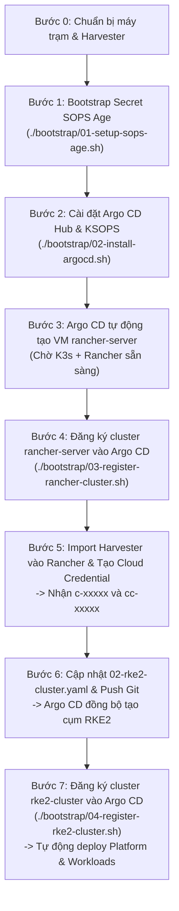

# Hướng Dẫn Cài Đặt Mới & Khôi Phục Toàn Diện (Fresh Install & Disaster Recovery)

Tài liệu này hướng dẫn chi tiết quy trình chuẩn để triển khai mới từ đầu (**Fresh Bootstrap**) hoặc khôi phục thảm họa toàn diện (**Disaster Recovery**) khi toàn bộ máy ảo (bao gồm cả máy ảo quản trị `rancher-server` và các máy ảo worker/controlplane của cụm RKE2 downstream) bị xóa sạch hoặc khi cài đặt trên một cụm Harvester hoàn toàn mới bằng **Argo CD Hub**.

---

## 1. Phân Biệt Hai Cấp Độ Khôi Phục

| Cấp độ | Phạm vi sự cố | Hành động cần làm | Thời gian phục hồi |
| :--- | :--- | :--- | :---: |
| **Cấp độ 1: Tự Phục Hồi Node RKE2** *(Rancher Server còn sống)* | Chỉ các máy ảo downstream `rke2-lab-cp-*` hoặc `rke2-lab-wk-*` bị xóa hoặc hỏng. | **Không cần can thiệp thủ công**. Argo CD và Rancher Node Driver sẽ tự động đối chiếu GitOps và sinh lại toàn bộ máy ảo mới. | ~3 - 5 phút |
| **Cấp độ 2: Fresh Install / Xoá Sạch Mọi VM** *(Mất cả Rancher Server)* | VM `rancher-server` bị xóa (mất cơ sở dữ liệu K3s/Rancher) hoặc cài đặt mới trên cụm Harvester trắng. | Thực hiện theo **Quy trình 6 bước** chi tiết bên dưới để lấy lại các mã định danh runtime (`c-xxxxx` và `cc-xxxxx`). | ~10 - 15 phút |

---

## 2. Bản Chất Các ID Runtime (`c-xxxxx` và `cc-xxxxx`)

Khi cài đặt Rancher Server mới từ đầu:
1. **`harvesterClusterId` (`c-xxxxx`)**: Là ID nội bộ bất biến do Rancher Controller tự động sinh theo mẫu ngẫu nhiên khi Harvester được import vào Rancher. **Không thể đổi thành tên ngữ nghĩa (semantic) như `harvester-local`** vì toàn bộ API routing, proxy endpoint và Harvester Node Driver đều bắt buộc dùng ID này.
2. **`cloudCredentialSecretName` (`cc-xxxxx`)**: Là tên Secret được Rancher tự động sinh trong namespace `cattle-global-data` khi bạn tạo Cloud Credential trên giao diện.

> [!IMPORTANT]
> Trong mô hình Argo CD mới, hai tham số này được quản lý tập trung và trực quan tại [`gitops/applications/02-rke2-cluster.yaml`](file://gitops/applications/02-rke2-cluster.yaml) (hoặc file mặc định [`gitops/infrastructure/rke2-cluster/values.yaml`](file://gitops/infrastructure/rke2-cluster/values.yaml)). Bạn chỉ cần cập nhật giá trị vào Application manifest mà không cần sửa code hạ tầng.

---

## 3. Quy Trình Cài Mới Hoàn Chỉnh (Step-by-Step)



---

### Bước 0: Điều Kiện Tiên Quyết Trên Máy Trạm (Mac/Linux)

Đảm bảo máy trạm đã cài đủ công cụ và có các tệp xác thực sau:
- Công cụ: `kubectl`, `helm`, `sops`, `age`, `jq`.
- Khóa bí mật Age đặt tại `~/.config/sops/age/keys.txt`.
- Tệp `kubeconfig.yaml` của cụm Harvester đặt tại thư mục gốc repository.

Kiểm tra kết nối tới Harvester:
```bash
kubectl --kubeconfig=kubeconfig.yaml get nodes
```

---

### Bước 1: Khởi Tạo Secret SOPS Age
```bash
./bootstrap/01-setup-sops-age.sh
```
Script tạo namespace `argocd` và nạp Secret `sops-age` chứa khóa Age private key lên Harvester.

---

### Bước 2: Cài Đặt Argo CD Hub & KSOPS
```bash
./bootstrap/02-install-argocd.sh
```
Argo CD Hub sẽ được cài đặt qua Helm kèm plugin KSOPS ConfigManagementPlugin (CMP). Script tự động kích hoạt Root Application (`gitops/root.yaml`).

Mở trình duyệt kiểm tra Dashboard:
- **URL**: [http://192.168.250.2:30080](http://192.168.250.2:30080)
- **Tài khoản**: `admin` (mật khẩu hiển thị trên terminal).

---

### Bước 3: Chờ Rancher Server Khởi Động & Bootstrap

1. Kiểm tra máy ảo `rancher-server` đã chạy trên Harvester:
   ```bash
   kubectl --kubeconfig=kubeconfig.yaml get vm,vmi -n default
   ```
2. Theo dõi tiến trình cài đặt K3s/Rancher bên trong máy ảo qua SSH:
   ```bash
   ./gitops/infrastructure/rancher-server/tail-log.sh
   ```
3. Kiểm tra Web UI của Rancher đã truy cập được tại:
   - URL: [https://rancher.192.168.250.2.sslip.io:31443](https://rancher.192.168.250.2.sslip.io:31443)
   - Tài khoản mặc định: `admin` / `admin@2026!!`

---

### Bước 4: Đăng Ký Cluster Rancher Server Vào Argo CD Hub

Chạy script tự động lấy Kubeconfig của Rancher và đăng ký vào Argo CD Hub:
```bash
./bootstrap/03-register-rancher-cluster.sh
```
Sau bước này, cluster `rancher-server` sẽ hiển thị trong mục **Settings > Clusters** trên giao diện Argo CD.

---

### Bước 5: Đăng Ký Harvester Vào Rancher & Tự Động Cấu Hình GitOps

Bạn có 2 cách thực hiện:

#### Cách 1: Chạy Script Tự Động Hóa 100% *(Khuyên dùng - 30 giây)*
Chỉ cần chạy 1 lệnh duy nhất trên máy trạm:
```bash
./bootstrap/03b-import-harvester.sh
```
Script sẽ tự động:
1. Tạo cluster `harvester-local` trên Rancher.
2. Lấy registration token & manifest áp dụng vào Harvester.
3. Đợi Auto-Healer cấu hình chứng chỉ TLS tĩnh an toàn.
4. Tự động tạo Cloud Credential `dev`.
5. Tự động cập nhật `harvesterClusterId` (`c-xxxxx`) và `cloudCredentialSecretName` (`cc-xxxxx`) vào [`gitops/applications/02-rke2-cluster.yaml`](file://gitops/applications/02-rke2-cluster.yaml).

Sau đó, bạn chỉ cần nhảy ngay sang **Bước 6** để commit & push git!

---

#### Cách 2: Thao Tác Thủ Công Trên Web UI
1. Đăng nhập Rancher Web UI: [https://rancher.192.168.250.2.sslip.io:31443](https://rancher.192.168.250.2.sslip.io:31443).
2. Vào **Cluster Management** -> **Import Existing Cluster** -> Chọn **Generic**.
3. Đặt **Cluster Name** là `harvester-local` -> Bấm **Create**.
4. Chạy câu lệnh đăng ký (`kubectl apply -f ...`) lên cụm Harvester.
5. Lấy mã **Cluster ID** mới (`c-xxxxx`):
   ```bash
   kubectl --kubeconfig=gitops/infrastructure/rancher-server/rancher-k3s-kubeconfig.yaml get clusters.management.cattle.io
   ```
6. Tạo Harvester Cloud Credential:
   - Vào **Cluster Management** -> **Cloud Credentials** -> **Create**.
   - Chọn loại: **Harvester**, đặt tên `dev`, chọn cluster `harvester-local`.
7. Lấy mã Secret Cloud Credential mới (`cc-xxxxx`):
   ```bash
   kubectl --kubeconfig=gitops/infrastructure/rancher-server/rancher-k3s-kubeconfig.yaml -n cattle-global-data get secrets -l cattle.io/creator=norman
   ```

> [!TIP]
> **Cơ chế Tự Động Vá Chứng Chỉ (Auto-Healer):**
> Trong cụm Harvester đã được cấu hình sẵn Deployment [`harvester-agent-healer`](file://gitops/infrastructure/rancher-server/05-harvester-agent-healer.yaml) qua Argo CD Hub. Ngay sau khi lệnh đăng ký được chạy, Auto-Healer sẽ tự động phát hiện Secret `cattle-system/tls-rancher-internal`, ký lại chứng chỉ với đầy đủ IP SANs (Service ClusterIP, Node IP, Harvester VIP) và kích hoạt chế độ tĩnh `listener.cattle.io/static: "true"`. Điều này ngăn chặn triệt để lỗi trắng trang 503 (`Handler disconnected`) và vòng lặp xung đột dynamiclistener!

---

### Bước 6: Commit & Push Git Kích Hoạt Tạo Cụm RKE2

1. Kiểm tra thay đổi trong file [`gitops/applications/02-rke2-cluster.yaml`](file://gitops/applications/02-rke2-cluster.yaml):
   ```bash
   git diff gitops/applications/02-rke2-cluster.yaml
   ```
2. Commit và push lên Git:
   ```bash
   git add gitops/applications/02-rke2-cluster.yaml
   git commit -m "chore: update Harvester Cluster ID and Cloud Credential for fresh install"
   git push
   ```
3. Argo CD sẽ tự động phát hiện và áp dụng Helm template sang Rancher Server. Rancher sẽ bắt đầu provisioning 3 máy ảo RKE2 trên Harvester.

---

### Bước 7: Đăng Ký Cụm Downstream RKE2 Vào Argo CD Hub

Sau khi cả 3 nodes RKE2 sẵn sàng (khoảng 5-10 phút), chạy:
```bash
./bootstrap/04-register-rke2-cluster.sh
```
Script sẽ lấy Kubeconfig cụm RKE2 và nạp vào Argo CD Hub. Ngay lập tức, Argo CD sẽ đồng bộ:
- `cert-manager` từ thư mục `gitops/platform/`
- Toàn bộ ứng dụng demo từ thư mục `gitops/workloads/`
lên cụm RKE2 hoàn toàn tự động!
