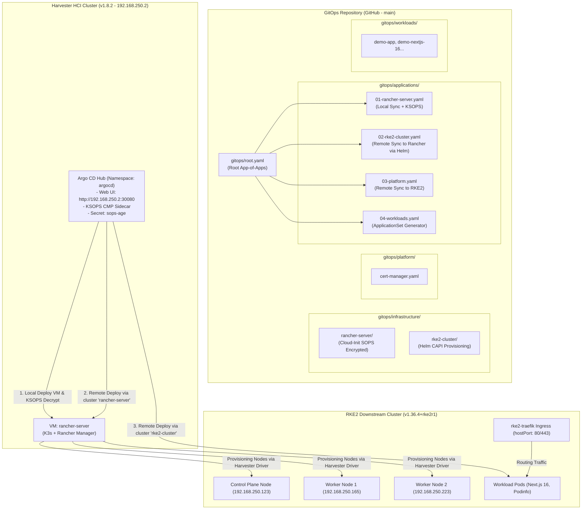

# Lab Harvester GitOps — Quản Lý Hạ Tầng Bằng Argo CD Hub & Rancher

Kho lưu trữ cấu hình **GitOps** hoàn chỉnh cho cụm **Harvester HCI v1.8.2**, quản lý toàn bộ vòng đời hạ tầng thông qua **Argo CD Hub (Mô hình Centralized Hub-and-Spoke)**, tự động hóa triển khai máy ảo quản trị **Rancher Server** chạy trên **openSUSE Leap Micro 6.2**, mã hóa an toàn với **SOPS + Age + KSOPS**, và tự động provisioning cụm Kubernetes downstream **RKE2 (1 Control Plane + 2 Workers)** trực tiếp từ Git.

---

## 1. Kiến Trúc GitOps Tập Trung (Centralized Hub-and-Spoke Architecture)

Toàn bộ hệ sinh thái từ máy ảo Harvester, cụm điều khiển Rancher đến các cụm Kubernetes con và ứng dụng người dùng được điều phối qua một điểm kiểm soát GitOps duy nhất:



---

## 2. Cấu Trúc Thư Mục Chuẩn

```text
.
├── .gitignore                          # Chặn kubeconfig, credentials, INFO.md
├── .sops.yaml                          # Cấu hình mã hóa SOPS với Age public key
├── INFO.example.md                     # File mẫu thông tin kết nối Harvester
├── README.md                           # Tài liệu tổng quan kiến trúc GitOps
├── FRESH_INSTALL_GUIDE.md              # Hướng dẫn chi tiết cài đặt mới & khôi phục
├── docs/
│   ├── AUTO_RECOVERY_GUIDE.md          # Cơ chế tự phục hồi (Self-Healing) sau reboot/cúp điện
│   ├── CERT_MANAGER_GUIDE.md           # Hướng dẫn kiến trúc Root CA nội bộ & ClusterIssuer TLS
│   ├── KUBE_VIP_GUIDE.md               # Hướng dẫn kiến trúc mạng ảo Kube-VIP (Layer 2 ARP)
│   └── SOPS_GUIDE.md                   # Hướng dẫn toàn diện về mã hóa SOPS, Age Key & KSOPS
├── bootstrap/                          # QUY TRÌNH BOOTSTRAP ARGO CD HUB
│   ├── 01-setup-sops-age.sh            # Tạo namespace argocd & Secret sops-age
│   ├── 02-install-argocd.sh            # Cài đặt Argo CD Hub Helm + KSOPS CMP & Root App
│   ├── 03-register-rancher-cluster.sh  # Lấy kubeconfig Rancher & đăng ký cluster vào Argo CD
│   ├── 04-register-rke2-cluster.sh     # Lấy kubeconfig RKE2 & đăng ký cluster vào Argo CD
│   ├── values-argocd-hub.yaml          # Cấu hình Helm values cho Argo CD Hub
│   └── README.md                       # Hướng dẫn chi tiết các bước bootstrap
└── gitops/                             # HỆ THỐNG GITOPS TẬP TRUNG (ARGO CD)
    ├── root.yaml                       # Root Application (App-of-Apps)
    ├── applications/                   # Danh mục Application con do Root App quản lý
    │   ├── 01-rancher-server.yaml      # Quản lý máy ảo Rancher Server trên Harvester
    │   ├── 02-rke2-cluster.yaml        # Quản lý cụm CAPI RKE2 trên Rancher Server
    │   ├── 02b-local-path-provisioner.yaml # Quản lý storage cục bộ RKE2
    │   ├── 02c-kube-vip.yaml           # Quản lý Kube-VIP daemonset
    │   ├── 03-platform.yaml            # Quản lý cert-manager Helm chart
    │   ├── 03a-cluster-issuers.yaml    # Quản lý Root CA & ClusterIssuer
    │   ├── 03b-monitoring.yaml         # Quản lý Prometheus & Grafana
    │   └── 04-workloads.yaml           # ApplicationSet tự động quét & triển khai app
    ├── infrastructure/                 # Manifest hạ tầng
    │   ├── rancher-server/             # KubeVirt VM, Cloud-Init (SOPS), Services Rancher
    │   └── rke2-cluster/               # Helm Chart CAPI (HarvesterConfig, Cluster CR)
    ├── platform/                       # Công cụ nền tảng cho downstream
    │   ├── cluster-issuers/            # Root CA 10 năm, ClusterIssuer, Traefik HTTPS redirect
    │   ├── kube-vip/                   # Manifests Kube-VIP DaemonSet, RBAC, PodMonitor
    │   └── local-path-provisioner/     # Local Path Provisioner StorageClass
    └── workloads/                      # Danh mục các app nghiệp vụ (Zero-Touch GitOps)
        ├── demo-app/                   # Podinfo sample app
        └── demo-nextjs-16/             # Next.js 16 standalone demo app
```

---

## 3. Hướng Dẫn Khởi Chạy Nhanh (Quickstart)

### Bước 1: Chuẩn bị môi trường & Kubeconfig Harvester
Đặt file `kubeconfig.yaml` của cụm Harvester vào thư mục gốc của repository:
```bash
kubectl --kubeconfig=kubeconfig.yaml get nodes
```

### Bước 2: Khởi tạo Secret SOPS Age
Đảm bảo máy trạm đã có file key tại `~/.config/sops/age/keys.txt`:
```bash
./bootstrap/01-setup-sops-age.sh
```

### Bước 3: Cài đặt Argo CD Hub & KSOPS
```bash
./bootstrap/02-install-argocd.sh
```
Argo CD Hub sẽ được cài đặt lên Harvester với giao diện Web UI và plugin KSOPS. Sau khi xong, truy cập Dashboard tại:
- **URL**: [http://192.168.250.2:30080](http://192.168.250.2:30080)
- **Tài khoản**: `admin`
- **Mật khẩu**: Lấy từ terminal output của script.

### Bước 4: Đăng ký Rancher Server Cluster
Khi máy ảo `rancher-server` khởi động xong và nhận IP (sau 2-3 phút):
```bash
./bootstrap/03-register-rancher-cluster.sh
```
Argo CD sẽ tự động đẩy manifest CAPI sang Rancher để tạo cụm RKE2.

### Bước 5: Đăng ký Cụm Downstream RKE2
Khi cụm RKE2 được Rancher tạo xong (sau 5-10 phút):
```bash
./bootstrap/04-register-rke2-cluster.sh
```
Toàn bộ `platform` và `workloads` sẽ tự động được Argo CD đồng bộ lên cụm RKE2!

---

## 4. Thông Tin Truy Cập & Đăng Nhập

- **Argo CD Hub Web UI**: [http://192.168.250.2:30080](http://192.168.250.2:30080)
  - Tài khoản: `admin`
- **Rancher Server Web UI**: [https://rancher.192.168.250.30.sslip.io](https://rancher.192.168.250.30.sslip.io) (Cổng HTTPS 443 chuẩn)
  - Tài khoản: `admin` / Mật khẩu: `admin@2026!!`
- **SSH máy ảo Rancher**:
  ```bash
  ssh opensuse@192.168.250.30
  ```
- **Kubeconfig RKE2**:
  ```bash
  kubectl --kubeconfig=gitops/infrastructure/rke2-cluster/rke2-kubeconfig.yaml get nodes -o wide
  ```

---

## 5. Cơ Chế Tự Phục Hồi & Tự Động Hóa Vận Hành (Self-Healing)

Hệ thống được tích hợp sẵn cơ chế **Tự Phục Hồi Đa Tầng (Self-Healing)** để đảm bảo khi máy chủ vật lý bị khởi động lại hoặc mất điện đột ngột:
- **Tự khắc phục lỗi 502 Harvester**: Daemon `harvester-agent-healer` liên tục quét và tự động chuyển các CRD `cluster.x-k8s.io` về `strategy: None`.
- **Tự bật lại toàn bộ máy ảo (`runStrategy: Always`)**: KubeVirt tự động spawn lại `rancher-server` và các node RKE2 ngay khi node khởi động xong.
- **Tự kết nối lại cluster agent**: Kênh kết nối giữa Harvester và Rancher Server tự động phục hồi trong vòng 3-5 phút sau khi cắm điện lại.
- **Tắt máy an toàn (Graceful Shutdown)**:
  ```bash
  ssh rancher@192.168.250.2 "sudo poweroff"
  ```

👉 Xem chi tiết cấu trúc kiến trúc và hướng dẫn vận hành tại: [`docs/AUTO_RECOVERY_GUIDE.md`](file:///Users/timi/lab/lab-harvester/docs/AUTO_RECOVERY_GUIDE.md).
👉 Hướng dẫn bảo mật & mã hóa bí mật GitOps với SOPS + Age: [`docs/SOPS_GUIDE.md`](file:///Users/timi/lab/lab-harvester/docs/SOPS_GUIDE.md).
👉 Hướng dẫn kiến trúc & vận hành mạng ảo Kube-VIP (ARP Leader Election): [`docs/KUBE_VIP_GUIDE.md`](file:///Users/timi/lab/lab-harvester/docs/KUBE_VIP_GUIDE.md).
👉 Hướng dẫn kiến trúc Root CA & ClusterIssuer tự động hóa HTTPS: [`docs/CERT_MANAGER_GUIDE.md`](file:///Users/timi/lab/lab-harvester/docs/CERT_MANAGER_GUIDE.md).
👉 Hướng dẫn giám sát thời gian thực Netdata (Parent-Child & Bypass Cloud): [`docs/NETDATA_GUIDE.md`](file:///Users/timi/lab/lab-harvester/docs/NETDATA_GUIDE.md).


