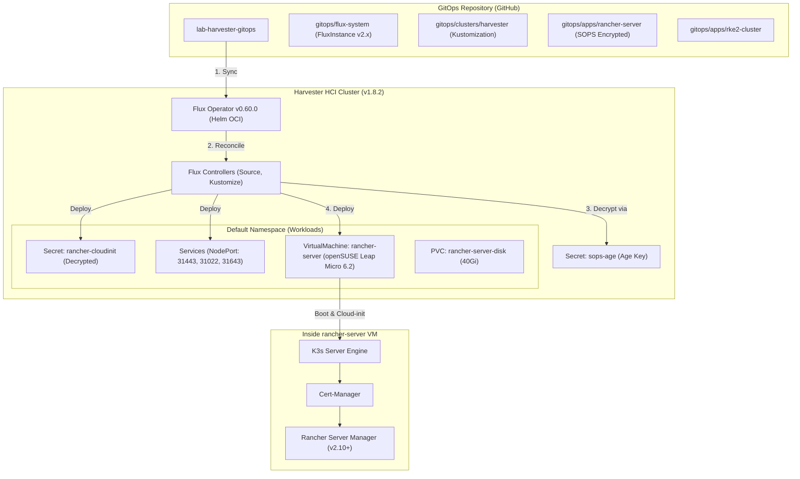

# Lab Harvester GitOps — Quản Lý Hạ Tầng Bằng Flux Operator & Rancher

Kho lưu trữ cấu hình **GitOps** cho cụm **Harvester HCI v1.8.2**, quản lý vòng đời hạ tầng thông qua **Flux Operator v0.60.0**, tự động hóa triển khai máy ảo **Rancher Server** chạy trên hệ điều hành **openSUSE Leap Micro 6.2**, mã hóa bảo mật bí mật với **SOPS + Age**, và sẵn sàng cấp phát các cụm Kubernetes downstream **RKE2**.

---

## 1. Kiến Trúc Tổng Quan



---

## 2. Cấu Trúc Thư Mục Chuẩn

```text
.
├── .gitignore                          # Chặn kubeconfig, credentials, INFO.md
├── .sops.yaml                          # Cấu hình mã hóa SOPS với Age public key
├── INFO.example.md                     # File mẫu thông tin kết nối Harvester
├── README.md                           # Tài liệu tổng quan kiến trúc GitOps
├── bootstrap/
│   ├── 01-setup-sops-age.sh            # Tạo namespace flux-system & Secret sops-age
│   ├── 02-install-flux-operator.sh     # Cài Flux Operator v0.60.0 & apply FluxInstance
│   └── README.md                       # Hướng dẫn chi tiết quy trình bootstrap
└── gitops/
    ├── flux-system/
    │   ├── flux-instance.yaml          # Khai báo FluxInstance (FluxCD v2.x latest)
    │   └── kustomization.yaml
    ├── clusters/
    │   └── harvester/
    │       ├── kustomization.yaml      # Điểm vào root sync của cluster
    │       └── sync-rancher-server.yaml# Flux Kustomization sync Rancher (kèm SOPS decrypt)
    └── apps/
        ├── rancher-server/
        │   ├── 00-image.yaml           # VirtualMachineImage openSUSE Leap Micro 6.2
        │   ├── 01-cloud-init.yaml      # Secret cloud-init (ĐÃ MÃ HÓA SOPS)
        │   ├── 02-services.yaml        # NodePort Services (31443, 31080, 31022, 31643)
        │   ├── 03-vm.yaml              # KubeVirt VirtualMachine rancher-server
        │   ├── harvester-import.yaml   # Manifest cattle cluster-agent import Harvester
        │   ├── kustomization.yaml      # Kustomization đóng gói Rancher Server
        │   ├── get-kubeconfig.sh       # Script lấy Kubeconfig Rancher K3s về Mac
        │   ├── tail-log.sh             # Script xem log cài đặt bootstrap thời gian thực
        │   └── README.md
        └── rke2-cluster/
            ├── 00-image.yaml           # VirtualMachineImage openSUSE Leap Micro 6.2
            ├── 01-machine-configs.yaml # HarvesterConfig templates cho RKE2 nodes
            ├── 02-cluster.yaml         # Cấu hình cụm RKE2 downstream
            ├── apply.sh                # Script áp dụng cấu hình lên Rancher
            ├── kustomization.yaml
            └── README.md
```

---

## 3. Hướng Dẫn Khởi Chạy Nhanh (Quickstart)

### Bước 1: Chuẩn bị môi trường & Kubeconfig Harvester
Đặt file `kubeconfig.yaml` của cụm Harvester vào thư mục gốc của repository (file này đã được chặn bởi `.gitignore`).

Kiểm tra kết nối:
```bash
kubectl --kubeconfig=kubeconfig.yaml get nodes
```

### Bước 2: Khởi tạo Secret SOPS Age
Đảm bảo máy trạm đã có file key tại `~/.config/sops/age/keys.txt`:
```bash
./bootstrap/01-setup-sops-age.sh
```

### Bước 3: Cài đặt Flux Operator v0.60.0 & Kích hoạt GitOps
```bash
./bootstrap/02-install-flux-operator.sh
```
Flux Operator sẽ khởi chạy `FluxInstance`, kết nối tới repository GitHub và tự động đồng bộ cấu hình máy ảo `rancher-server`.

### Bước 4: Theo dõi tiến trình khởi tạo Rancher Server
1. **Kiểm tra máy ảo trên Harvester**:
   ```bash
   kubectl --kubeconfig=kubeconfig.yaml -n default get vm,vmi rancher-server
   ```
2. **Theo dõi log bootstrap K3s/Rancher bên trong máy ảo qua SSH**:
   ```bash
   ./gitops/apps/rancher-server/tail-log.sh
   ```
3. **Lấy Kubeconfig cụm K3s quản lý Rancher**:
   ```bash
   ./gitops/apps/rancher-server/get-kubeconfig.sh
   ```

---

## 4. Thông Tin Truy Cập & Đăng Nhập

- **Web UI Rancher Server**: [https://rancher.192.168.250.2.sslip.io:31443](https://rancher.192.168.250.2.sslip.io:31443)
- **Tài khoản**: `admin`
- **Mật khẩu khởi tạo**: `admin@2026!!`
- **SSH máy ảo Rancher**:
  ```bash
  ssh -p 31022 opensuse@192.168.250.2
  ```
  *(Mật khẩu: `rancher@2026!` hoặc dùng SSH Key Mac đã đăng ký).*

- **Flux Operator Dashboard**:
  ```bash
  kubectl -n flux-system port-forward svc/flux-operator 9080:9080
  ```
  Mở trình duyệt tại [http://localhost:9080](http://localhost:9080).

---

## 5. Tự Động Hóa Cụm RKE2 Downstream Qua GitOps (Không Dùng Script)

Cụm RKE2 downstream được quản lý **100% tự động qua GitOps** bằng cơ chế **Flux Multi-Cluster Remote Sync**:
- Flux trên Harvester sử dụng Secret `rancher-kubeconfig` trong namespace `flux-system` để đồng bộ trực tiếp tài nguyên tại `./gitops/apps/rke2-cluster` vào API của Rancher Server.
- Rancher Server tự động kết nối với Harvester HCI và gọi Harvester Node Driver để tự động sinh 3 máy ảo **openSUSE Leap Micro 6.2** (1 Control Plane + 2 Workers).
- Bạn không cần chạy bất kỳ lệnh `apply.sh` thủ công nào; mọi thay đổi về số lượng node, RAM, CPU hay phiên bản Kubernetes chỉ cần chỉnh sửa trong Git và `git push`.
