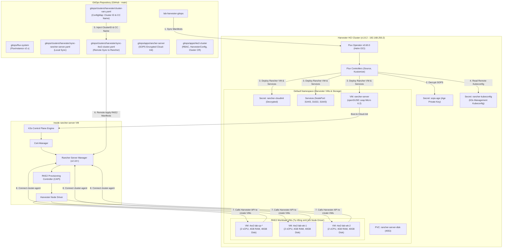

# Lab Harvester GitOps — Quản Lý Hạ Tầng Bằng Flux Operator & Rancher

Kho lưu trữ cấu hình **GitOps** hoàn chỉnh cho cụm **Harvester HCI v1.8.2**, quản lý toàn bộ vòng đời hạ tầng thông qua **Flux Operator v0.60.0 (FluxCD v2.x)**, tự động hóa triển khai máy ảo quản trị **Rancher Server** chạy trên **openSUSE Leap Micro 6.2**, mã hóa an toàn với **SOPS + Age**, và tự động provisioning cụm Kubernetes downstream **RKE2 (1 Control Plane + 2 Workers)** trực tiếp từ Git.

---

## 1. Kiến Trúc Hai Tầng GitOps (Two-Tier GitOps Architecture)



---

## 2. Cấu Trúc Thư Mục Chuẩn

```text
.
├── .gitignore                          # Chặn kubeconfig, credentials, INFO.md
├── .sops.yaml                          # Cấu hình mã hóa SOPS với Age public key
├── INFO.example.md                     # File mẫu thông tin kết nối Harvester
├── README.md                           # Tài liệu tổng quan kiến trúc GitOps
├── bootstrap/
│   ├── 01-setup-sops-age.sh            # Tạo namespace flux-system & Secret sops-age
│   ├── 02-install-flux-operator.sh     # Cài Flux Operator v0.60.0 & apply FluxInstance
│   └── README.md                       # Hướng dẫn chi tiết quy trình bootstrap
└── gitops/
    ├── flux-system/
    │   ├── flux-instance.yaml          # Khai báo FluxInstance (FluxCD v2.x latest)
    │   └── kustomization.yaml
    ├── clusters/
    │   └── harvester/
    │       ├── cluster-vars.yaml       # ConfigMap lưu biến tập trung: HARVESTER_CLUSTER_ID, CC_NAME
    │       ├── kustomization.yaml      # Điểm vào root sync của Harvester cluster
    │       ├── sync-rancher-server.yaml# Flux Kustomization đồng bộ máy ảo Rancher Server (SOPS)
    │       └── sync-rke2-cluster.yaml  # Flux Remote Kustomization đồng bộ cụm RKE2 vào Rancher
    └── apps/
        ├── rancher-server/
        │   ├── 00-image.yaml           # VirtualMachineImage openSUSE Leap Micro 6.2
        │   ├── 01-cloud-init.yaml      # Secret cloud-init (ĐÃ MÃ HÓA SOPS)
        │   ├── 02-services.yaml        # NodePort Services (31443, 31080, 31022, 31643)
        │   ├── 03-vm.yaml              # KubeVirt VirtualMachine rancher-server
        │   ├── harvester-import.yaml   # Manifest cattle cluster-agent import Harvester vào Rancher
        │   ├── kustomization.yaml      # Kustomization đóng gói Rancher Server
        │   ├── get-kubeconfig.sh       # Script lấy Kubeconfig Rancher K3s về Mac
        │   ├── tail-log.sh             # Script xem log cài đặt bootstrap thời gian thực
        │   ├── rancher-k3s-kubeconfig.yaml # Kubeconfig truy cập K3s quản lý Rancher
        │   └── README.md
        └── rke2-cluster/
            ├── 00-rbac.yaml            # RBAC ClusterRole/Binding cho Machine Provisioner
            ├── 01-machine-configs.yaml # HarvesterConfig templates cho RKE2 nodes (${HARVESTER_CLUSTER_ID})
            ├── 02-cluster.yaml         # Cấu hình cụm RKE2 downstream (1 CP + 2 Workers)
            ├── kustomization.yaml      # Kustomization đóng gói cấu hình RKE2
            ├── get-kubeconfig.sh       # Script lấy Kubeconfig RKE2 về máy Mac
            ├── rke2-kubeconfig.yaml    # Kubeconfig truy cập cụm RKE2 qua Rancher Proxy
            └── README.md
```

---

## 3. Hướng Dẫn Khởi Chạy Nhanh (Quickstart)

### Bước 1: Chuẩn bị môi trường & Kubeconfig Harvester
Đặt file `kubeconfig.yaml` của cụm Harvester vào thư mục gốc của repository (file này đã được chặn bởi `.gitignore`).

Kiểm tra kết nối:
```bash
kubectl --kubeconfig=kubeconfig.yaml get nodes
```

### Bước 2: Khởi tạo Secret SOPS Age
Đảm bảo máy trạm đã có file key tại `~/.config/sops/age/keys.txt`:
```bash
./bootstrap/01-setup-sops-age.sh
```

### Bước 3: Cài đặt Flux Operator v0.60.0 & Kích hoạt GitOps
```bash
./bootstrap/02-install-flux-operator.sh
```
Flux Operator sẽ khởi chạy `FluxInstance`, kết nối tới repository GitHub và tự động đồng bộ cấu hình máy ảo `rancher-server`.

### Bước 4: Theo dõi tiến trình khởi tạo Rancher Server
1. **Kiểm tra máy ảo trên Harvester**:
   ```bash
   kubectl --kubeconfig=kubeconfig.yaml -n default get vm,vmi rancher-server
   ```
2. **Theo dõi log bootstrap K3s/Rancher bên trong máy ảo qua SSH**:
   ```bash
   ./gitops/apps/rancher-server/tail-log.sh
   ```
3. **Lấy Kubeconfig cụm K3s quản lý Rancher**:
   ```bash
   ./gitops/apps/rancher-server/get-kubeconfig.sh
   ```

---

## 4. Thông Tin Truy Cập & Đăng Nhập

- **Web UI Rancher Server**: [https://rancher.192.168.250.2.sslip.io:31443](https://rancher.192.168.250.2.sslip.io:31443)
- **Tài khoản**: `admin`
- **Mật khẩu khởi tạo**: `admin@2026!!`
- **SSH máy ảo Rancher**:
  ```bash
  ssh -p 31022 opensuse@192.168.250.2
  ```
  *(Mật khẩu: `rancher@2026!` hoặc dùng SSH Key cá nhân đã đăng ký).*

- **Flux Operator Dashboard**:
  ```bash
  kubectl -n flux-system port-forward svc/flux-operator 9080:9080
  ```
  Mở trình duyệt tại [http://localhost:9080](http://localhost:9080).

---

## 5. Tự Động Hóa Cụm RKE2 Downstream Qua GitOps (Không Dùng Script)

Cụm RKE2 downstream được quản lý **100% tự động qua GitOps** bằng cơ chế **Flux Multi-Cluster Remote Sync**:
- **Cơ chế hoạt động**: Flux trên Harvester sử dụng Secret `rancher-kubeconfig` trong namespace `flux-system` để đồng bộ trực tiếp tài nguyên tại `./gitops/apps/rke2-cluster` vào API của Rancher Server.
- **Loại bỏ Hardcode (PostBuild Variable Substitution)**:
  * Biến `${HARVESTER_CLUSTER_ID}` và `${HARVESTER_CLOUD_CREDENTIAL_SECRET_NAME}` được quản lý tập trung tại [cluster-vars.yaml](file://gitops/clusters/harvester/cluster-vars.yaml).
  * Flux tự động inject các giá trị này vào file manifest khi build mà không làm phụ thuộc mã nguồn vào ID ngẫu nhiên của Rancher.
- **Tự động sinh hạ tầng**: Rancher Server gọi Harvester Node Driver để khởi tạo 3 máy ảo:
  * **1 Control Plane + ETCD**: `rke2-lab-cp-*` (2 vCPU, 4GB RAM, 40GB Disk)
  * **2 Worker Nodes**: `rke2-lab-wk-*` (2 vCPU, 4GB RAM, 40GB Disk)
- **Truy cập cụm RKE2 từ máy Mac**:
  ```bash
  kubectl --kubeconfig=gitops/apps/rke2-cluster/rke2-kubeconfig.yaml --insecure-skip-tls-verify get nodes -o wide
  ```

---

## 6. Khả Năng Tự Phục Hồi & Tái Khởi Tạo (Self-Healing & Disaster Recovery)

Hệ thống hỗ trợ 2 cấp độ phục hồi và tái khởi tạo:

### Cấp độ 1: Tự phục hồi các máy ảo RKE2 (Rancher Server còn sống)
- **Thử nghiệm xoá sạch toàn bộ máy ảo RKE2**: Khi toàn bộ 3 máy ảo cụm RKE2 bị xoá khỏi hệ thống:
  ```bash
  kubectl --kubeconfig=gitops/apps/rancher-server/rancher-k3s-kubeconfig.yaml -n fleet-default delete cluster.provisioning.cattle.io rke2-lab
  ```
- **Tự động tái tạo từ GitOps**:
  ```bash
  flux --kubeconfig=kubeconfig.yaml reconcile kustomization rke2-cluster --with-source
  ```
  FluxCD lập tức đối chiếu trạng thái mong muốn từ Git repository và điều phối Rancher + Harvester Node Driver tạo lại mới 100% cả 3 máy ảo, cấu hình lại mạng CNI Calico và đưa toàn bộ các Node về trạng thái `Ready` hoàn toàn tự động mà không cần can thiệp thủ công.

### Cấp độ 2: Khôi phục thảm họa toàn diện hoặc Cài đặt trên máy mới (Fresh Install)
Khi toàn bộ hệ thống bị xóa sạch (bao gồm cả máy ảo `rancher-server` chứa database K3s/Rancher) hoặc khi triển khai trên cụm Harvester mới từ đầu:
- Rancher sẽ sinh ra các mã định danh runtime mới ngẫu nhiên (`HARVESTER_CLUSTER_ID` và `HARVESTER_CLOUD_CREDENTIAL_SECRET_NAME`).
- Bạn chỉ cần làm theo hướng dẫn tuần tự từng bước tại:
  👉 **[FRESH_INSTALL_GUIDE.md](file://FRESH_INSTALL_GUIDE.md) - Hướng Dẫn Cài Đặt Mới & Khôi Phục Toàn Diện**

