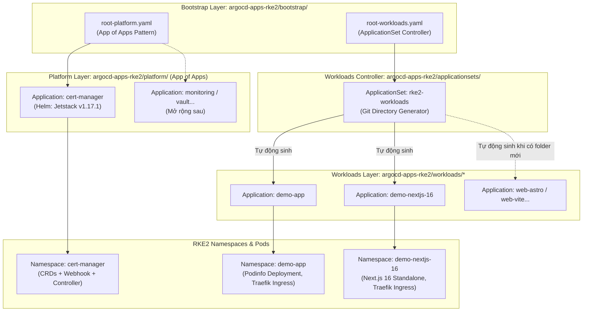

# Cụm RKE2 Downstream — Mô Hình Hybrid GitOps (App of Apps + ApplicationSet)

Thư mục này dành riêng cho **Argo CD** tự động quản lý và đồng bộ toàn bộ ứng dụng trên cụm downstream **RKE2 (v1.36.4+rke2r1)** theo mô hình **Hybrid GitOps** (kết hợp **App of Apps** cho hạ tầng/platform và **ApplicationSet** cho app nghiệp vụ/workloads).

---

## 1. Kiến Trúc Hybrid GitOps (App of Apps + ApplicationSet)

Hệ thống kết hợp cả 2 mô hình thiết kế chuẩn mực của Argo CD:
- **App of Apps (`platform/`)**: Quản lý các công cụ nền tảng/hạ tầng độc lập (Cert-Manager, Monitoring, Ingress...). Mỗi công cụ sử dụng Helm Chart chính thức từ nhà phát triển với values và Sync-Wave riêng.
- **ApplicationSet (`workloads/`)**: Quản lý các ứng dụng nghiệp vụ tự động (Zero-Touch GitOps). Bất kỳ khi nào tạo thêm thư mục app mới trong `workloads/`, Argo CD sẽ tự động phát hiện và sinh ra `Application` tương ứng.
- **2 Root Applications (`bootstrap/`)**: Tách biệt hoàn toàn rủi ro (Blast Radius) giữa tầng Hạ Tầng (ít thay đổi, yêu cầu quyền cao) và tầng Ứng Dụng (dev commit liên tục).



---

## 2. Hướng Dẫn Khởi Tạo Lần Đầu (Bootstrap)

Sau khi Argo CD đã được cài đặt trên cụm RKE2, chỉ cần áp dụng toàn bộ thư mục `bootstrap/` bằng một lệnh duy nhất:

```bash
# Sử dụng kubeconfig của cụm RKE2 downstream
KUBECONFIG=/path/to/rke2-kubeconfig kubectl apply -f argocd-apps-rke2/bootstrap/
```

Sau khi chạy lệnh trên:
1. `root-platform` sẽ tự động quét thư mục `platform/` và cài đặt `cert-manager` cùng các platform tools khác.
2. `root-workloads` sẽ triển khai `applicationset-workloads.yaml`, từ đó ApplicationSet Controller tự động quét `workloads/*` để dựng `demo-app` và `demo-nextjs-16`.

---

## 3. Ingress & Routing (Traefik v3 Mặc Định Của RKE2)

Traefik lắng nghe trực tiếp trên cổng `80/443` thông qua `hostPort` trên 2 Worker Nodes:
- **Worker 1**: `192.168.250.165`
- **Worker 2**: `192.168.250.223`

### Danh mục địa chỉ truy cập dịch vụ:
| Dịch vụ | Tên miền sslip.io (Worker 1) | Tên miền sslip.io (Worker 2) | Port / Ghi chú |
| :--- | :--- | :--- | :--- |
| **Argo CD Web UI** | `http://argocd.192.168.250.165.sslip.io` | `http://argocd.192.168.250.223.sslip.io` | NodePort 30080 / Ingress 80 |
| **Demo App (Podinfo)** | `http://demo.192.168.250.165.sslip.io` | `http://demo.192.168.250.223.sslip.io` | Port 9898 (2 replicas) |
| **Next.js 16 Demo** | `http://nextjs16.192.168.250.165.sslip.io` | `http://nextjs16.192.168.250.223.sslip.io` | Port 3000 (2 replicas) |

---

## 4. Hướng Dẫn Thêm Dịch Vụ Mới

### 4.1. Thêm một Platform/Infra Tool (App of Apps):
1. Tạo một file manifest mới tại `argocd-apps-rke2/platform/<tool-name>.yaml`.
2. Định nghĩa tài nguyên `kind: Application` trỏ đến Helm Chart chính thức (ví dụ Prometheus, Vault, Redis Operator).
3. Push lên git `main`. `root-platform` sẽ tự động phát hiện và đồng bộ.

### 4.2. Thêm một Workload/Web App (ApplicationSet Zero-Touch):
1. Tạo thư mục tại: `argocd-apps-rke2/workloads/<ten-app>/`.
2. Tạo các manifest tiêu chuẩn bên trong:
   - `deployment.yaml`
   - `service.yaml`
   - `ingress.yaml` (cấu hình host `<ten-app>.192.168.250.165.sslip.io`)
   - `kustomization.yaml`
3. Push lên git `main`. **ApplicationSet sẽ tự động tạo Application và triển khai ngay lập tức!**

### 4.3. Quy chuẩn đóng gói Container theo Framework:

| Framework | Kiểu ứng dụng | Container Runtime tối ưu | Port khuyến nghị |
| :--- | :--- | :--- | :--- |
| **Next.js 15/16** | Fullstack / SSR / App Router | Bắt buộc bật `output: 'standalone'` trong `next.config.js`. Chạy với `node:22-alpine` đa tầng. | `3000` |
| **Astro** | Static SSG (Blog, Landing, Docs) | Build HTML tĩnh ra thư mục `dist/`, chạy bằng `nginx:alpine` unprivileged. | `80` |
| **Vite (React/Vue)** | SPA (Single Page Application) | Build static ra `dist/`, chạy bằng `nginx:alpine` unprivileged có cấu hình `try_files $uri /index.html`. | `80` |

---

## 5. Quản Lý & Mã Hóa Secret Bằng SOPS + KSOPS

Tất cả các Secret nhạy cảm được mã hóa bằng **Age key** dùng chung với repo hạ tầng và giải mã tự động bằng plugin **KSOPS** tích hợp trong Argo CD.

```bash
# Mã hóa file secret dạng in-place bằng SOPS
sops -e -i my-secret.yaml
```
