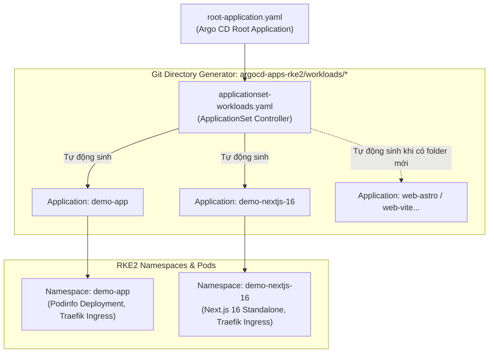

# Cụm RKE2 Downstream — Quản Lý Ứng Dụng Bằng Argo CD ApplicationSet & Traefik

Thư mục này dành riêng cho **Argo CD** tự động quản lý và đồng bộ toàn bộ ứng dụng, dịch vụ nền tảng (Platform Tools) và Workloads chạy trên cụm downstream **RKE2 (v1.36.4+rke2r1)**.

---

## 1. Kiến Trúc ApplicationSet (Zero-Touch GitOps)

Hệ thống sử dụng **Argo CD ApplicationSet** với **Git Directory Generator**. Bạn **không cần tạo thủ công file Application YAML** mỗi khi có app mới; chỉ cần thêm thư mục workload vào Git là Argo CD sẽ tự động phát hiện và triển khai.



---

## 2. Ingress & Routing (Traefik v3 Mặc Định Của RKE2)

Traefik lắng nghe trực tiếp trên cổng `80/443` thông qua `hostPort` trên 2 Worker Nodes:
- **Worker 1**: `192.168.250.165`
- **Worker 2**: `192.168.250.223`

### Danh mục địa chỉ truy cập dịch vụ:
| Dịch vụ | Tên miền sslip.io (Worker 1) | Tên miền sslip.io (Worker 2) | Port / Ghi chú |
| :--- | :--- | :--- | :--- |
| **Argo CD Web UI** | `http://argocd.192.168.250.165.sslip.io` | `http://argocd.192.168.250.223.sslip.io` | NodePort 30080 / Ingress 80 |
| **Demo App (Podinfo)** | `http://demo.192.168.250.165.sslip.io` | `http://demo.192.168.250.223.sslip.io` | Port 9898 (2 replicas) |
| **Next.js 16 Demo** | `http://nextjs-16.192.168.250.165.sslip.io` | `http://nextjs-16.192.168.250.223.sslip.io` | Port 3000 (2 replicas) |

---

## 3. Quy Chuẩn Triển Khai Web App (Next.js, Astro, Vite)

### 3.1. Hướng dẫn thêm một ứng dụng mới (Zero-Touch):
1. Tạo thư mục tại: `argocd-apps-rke2/workloads/<ten-app>/`.
2. Tạo các manifest tiêu chuẩn bên trong:
   - `deployment.yaml`
   - `service.yaml`
   - `ingress.yaml` (cấu hình host `<ten-app>.192.168.250.165.sslip.io`)
   - `kustomization.yaml`
3. Push lên git `main`. **ApplicationSet sẽ tự động tạo Application và triển khai ngay lập tức!**

### 3.2. Quy chuẩn đóng gói Container theo Framework:

| Framework | Kiểu ứng dụng | Container Runtime tối ưu | Port khuyến nghị |
| :--- | :--- | :--- | :--- |
| **Next.js 15/16** | Fullstack / SSR / App Router | Bắt buộc bật `output: 'standalone'` trong `next.config.js`. Chạy với `node:22-alpine` đa tầng. | `3000` |
| **Astro** | Static SSG (Blog, Landing, Docs) | Build HTML tĩnh ra thư mục `dist/`, chạy bằng `nginx:alpine` unprivileged. | `80` |
| **Vite (React/Vue)** | SPA (Single Page Application) | Build static ra `dist/`, chạy bằng `nginx:alpine` unprivileged có cấu hình `try_files $uri /index.html`. | `80` |

---

## 4. Quản Lý & Mã Hóa Secret Bằng SOPS + KSOPS

Tất cả các Secret nhạy cảm được mã hóa bằng **Age key** dùng chung với repo hạ tầng và giải mã tự động bằng plugin **KSOPS** tích hợp trong Argo CD.

```bash
# Mã hóa file secret dạng in-place bằng SOPS
sops -e -i my-secret.yaml
```
