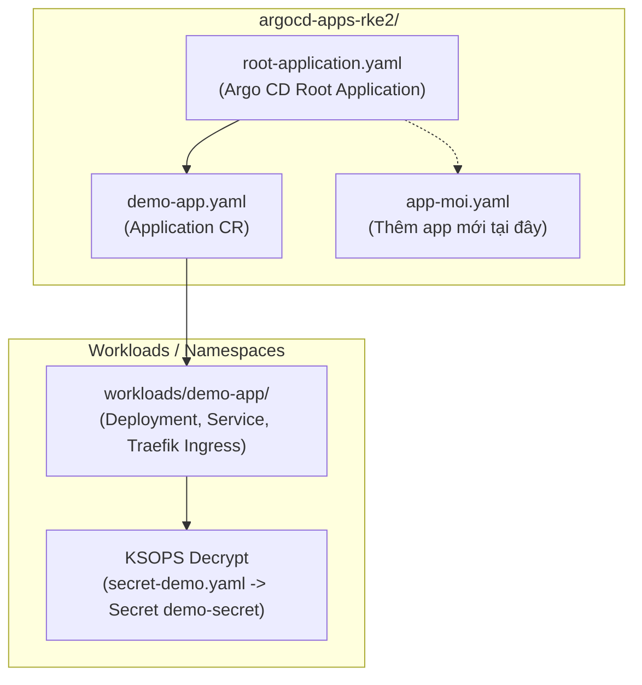

# Cụm RKE2 Downstream — Quản Lý Ứng Dụng Bằng Argo CD & Traefik

Thư mục này dành riêng cho **Argo CD** tự động quản lý và đồng bộ toàn bộ ứng dụng, dịch vụ nền tảng (Platform Tools) và Workloads chạy trên cụm downstream **RKE2 (v1.36.4+rke2r1)**.

---

## 1. Kiến Trúc Phân Lớp (App-of-Apps Pattern)



- **Root Application (`root-application.yaml`)**: Đóng vai trò làm Application cấp cha, tự động theo dõi thư mục `argocd-apps-rke2/`.
- **Mỗi ứng dụng con**: Được khai báo bằng một file `Application` (ví dụ: `demo-app.yaml`), trỏ đến thư mục chứa manifest cụ thể trong `workloads/`.

---

## 2. Ingress & Routing (Traefik v3 Mặc Định Của RKE2)

Từ RKE2 **v1.36+** (sau khi Kubernetes Ingress NGINX ngừng phát triển), **Traefik** là Ingress Controller mặc định của RKE2 (`traefik.io/ingress-controller`).

Traefik lắng nghe trực tiếp trên cổng `80/443` thông qua `hostPort` trên 2 Worker Nodes:
- **Worker 1**: `192.168.250.165`
- **Worker 2**: `192.168.250.223`

### Địa chỉ truy cập các dịch vụ:
| Dịch vụ | Tên miền sslip.io (Worker 1) | Tên miền sslip.io (Worker 2) |
| :--- | :--- | :--- |
| **Argo CD Web UI** | `http://argocd.192.168.250.165.sslip.io` | `http://argocd.192.168.250.223.sslip.io` |
| **Demo App (Podinfo)** | `http://demo.192.168.250.165.sslip.io` | `http://demo.192.168.250.223.sslip.io` |

---

## 3. Quản Lý & Mã Hóa Secret Bằng SOPS + KSOPS

Tất cả các Secret nhạy cảm (mật khẩu database, token, cert) được mã hóa bằng **Age key** dùng chung với repo hạ tầng và giải mã tự động bằng plugin **KSOPS** tích hợp trong Argo CD.

### 3.1. Mã hóa một file Secret mới:
```bash
# Tạo file secret dạng plain text
cat <<EOF > my-secret.yaml
apiVersion: v1
kind: Secret
metadata:
  name: my-secret
  namespace: my-app
type: Opaque
stringData:
  PASSWORD: "mat-khau-bi-mat"
EOF

# Mã hóa in-place bằng SOPS sử dụng cấu hình .sops.yaml ở thư mục gốc
sops -e -i my-secret.yaml
```

### 3.2. Cấu hình Kustomize tích hợp KSOPS:
Tạo file `secret-generator.yaml`:
```yaml
apiVersion: viaduct.ai/v1alpha1
kind: Ksops
metadata:
  name: my-secret-generator
files:
  - ./my-secret.yaml
```
Khai báo vào `kustomization.yaml`:
```yaml
generators:
  - secret-generator.yaml
```

---

## 4. Hướng Dẫn Thêm Một Ứng Dụng Mới

1. Tạo thư mục manifest tại: `argocd-apps-rke2/workloads/<ten-app>/` (gồm deployment, service, ingress, kustomization...).
2. Tạo file Application quản lý tại: `argocd-apps-rke2/<ten-app>.yaml`:
   ```yaml
   apiVersion: argoproj.io/v1alpha1
   kind: Application
   metadata:
     name: <ten-app>
     namespace: argocd
     finalizers:
       - resources-finalizer.argocd.argoproj.io
   spec:
     project: default
     source:
       repoURL: https://github.com/001123/lab-harvester-gitops.git
       targetRevision: main
       path: argocd-apps-rke2/workloads/<ten-app>
     destination:
       server: https://kubernetes.default.svc
       namespace: <ten-app>
     syncPolicy:
       automated:
         prune: true
         selfHeal: true
       syncOptions:
         - CreateNamespace=true
   ```
3. Commit & Push lên nhánh `main`. Argo CD Root Application sẽ tự động phát hiện và đồng bộ ứng dụng mới vào cụm RKE2.
