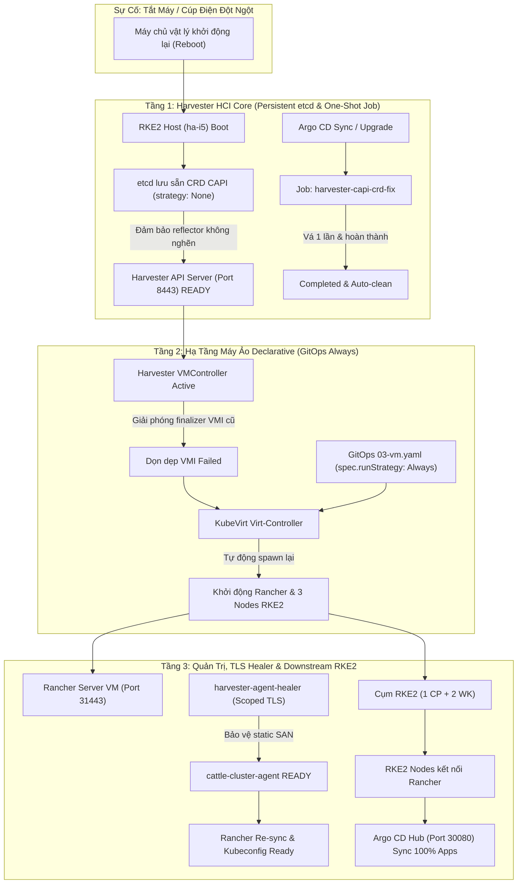

# Hướng Dẫn Tự Phục Hồi & Tự Động Hóa Vận Hành (Self-Healing Guide)

Tài liệu này giải thích chi tiết cơ chế **Tự Phục Hồi Toàn Diện (Full Self-Healing Architecture)** của hệ thống Lab Harvester + Rancher + RKE2, đảm bảo toàn bộ hệ thống tự động hoạt động ổn định 100% sau mỗi lần khởi động lại, cúp điện hoặc tắt máy đột ngột mà **không cần can thiệp thủ công**.

---

## 1. Kiến Trúc Tự Phục Hồi Đa Tầng Chuẩn Hóa (Clean GitOps Architecture)



---

## 2. Chi Tiết Các Cơ Chế Tự Phục Hồi Chuẩn Hóa

### Tầng 1: Triệt tiêu vĩnh viễn lỗi 502 Harvester Web UI (CAPI Migration Job & etcd Persistence)
- **Bản chất kỹ thuật**: 
  - Trước đây, một số CRD `cluster.x-k8s.io` có cấu hình `spec.conversion.strategy: Webhook` trỏ tới `capi-webhook-service.cattle-capi-system.svc:443` (service không tồn tại).
  - Khi Harvester API Server khởi động, reflector cache bị nghẽn vĩnh viễn khi watch các CRD này, dẫn tới cổng 8443 không mở và Nginx Ingress báo **`502 Bad Gateway`**.
- **Giải pháp chuẩn hóa (Kubernetes Job & Declarative)**:
  - CRD sau khi được đưa về `spec.conversion.strategy: None` sẽ được lưu bền vững trong cơ sở dữ liệu `etcd` của Host. Do đó, **khi reboot máy chủ, etcd vẫn giữ nguyên trạng thái `None` mà không bị mất**.
  - File [`gitops/infrastructure/rancher-server/05a-capi-crd-fix-job.yaml`](file:///Users/timi/lab/lab-harvester/gitops/infrastructure/rancher-server/05a-capi-crd-fix-job.yaml) định nghĩa Kubernetes `Job` với hook `argocd.argoproj.io/hook: Sync`.
  - Mỗi khi đồng bộ hoặc sau nâng cấp hệ thống, Job chạy 1 lần duy nhất để rà soát toàn bộ 13 CRD CAPI, xác nhận hợp lệ rồi tự động kết thúc (`Completed`) và dọn dẹp sau 120 giây. Không tạo vòng lặp chạy nền liên tục.

---

### Tầng 2: Khôi phục máy ảo tự động bằng GitOps Declarative (`runStrategy: Always`)
- **Bản chất kỹ thuật**:
  - Mặc định máy ảo tạo thủ công có thể dùng `RerunOnFailure`. Khi cúp điện đột ngột, instance bị đánh dấu `Failed` và có thể kẹt finalizer mạng nếu apiserver chưa sẵn sàng.
- **Giải pháp chuẩn hóa**:
  - Khai báo trực tiếp `spec.runStrategy: Always` trong file [`gitops/infrastructure/rancher-server/03-vm.yaml`](file:///Users/timi/lab/lab-harvester/gitops/infrastructure/rancher-server/03-vm.yaml).
  - Argo CD với chính sách `selfHeal: true` bảo đảm KubeVirt luôn duy trì trạng thái chạy cho máy ảo mà không cần bất kỳ script nào can thiệp từ bên ngoài.
  - Ngay khi Harvester API hoạt động, KubeVirt lập tức tạo pod launcher mới và bật lại máy ảo.

---

### Tầng 3: Giám sát chứng chỉ nội bộ Rancher Agent (Scoped TLS Healer)
- **Bản chất kỹ thuật**:
  - Cơ chế Dynamic Listener của Rancher xung đột với Virtual IP (VIP) của Harvester, có thể gây mất SAN IP dẫn đến `503 Handler disconnected`.
- **Giải pháp chuẩn hóa**:
  - Daemon [`harvester-agent-healer`](file:///Users/timi/lab/lab-harvester/gitops/infrastructure/rancher-server/05-harvester-agent-healer.yaml) được thu hẹp quyền RBAC tối thiểu (chỉ tác động namespace `cattle-system`).
  - Đóng vai trò watchdog độc lập: Tự động trích xuất CA nội bộ, tạo Secret tĩnh `tls-rancher-internal` kèm đầy đủ SAN Node IP & VIP, gắn cờ `listener.cattle.io/static: "true"` theo đúng tài liệu chính thức từ SUSE Rancher.

---

## 3. Quy Trình Vận Hành Chuẩn (Best Practices)

### A. Quy trình Tắt máy an toàn (Graceful Shutdown)
Khi bạn chủ động muốn tắt máy chủ lab, **tránh bấm nút nguồn cứng hoặc ngắt cầu dao**. Hãy chạy 1 lệnh từ máy tính:

```bash
ssh rancher@192.168.250.2 "sudo poweroff"
```

**Lợi ích**:
1. Host gửi tín hiệu ACPI Shutdown tới tất cả các máy ảo KubeVirt.
2. Các máy ảo có 120 giây (`terminationGracePeriodSeconds: 120`) để flush dữ liệu bộ nhớ đệm xuống ổ cứng Longhorn, dừng `etcd` sạch sẽ và unmount filesystem an toàn.
3. Node Harvester tắt an toàn, loại trừ 100% lỗi phân mảnh dữ liệu hoặc tiến trình mồ côi.

---

### B. Quy trình Bật máy & Thời gian khởi động kỳ vọng
Khi bạn bật nguồn máy chủ vật lý, toàn bộ hạ tầng sẽ tuần tự tự phục hồi theo mốc thời gian:

| Mốc thời gian | Sự kiện diễn ra | Trạng thái kiểm tra |
| :--- | :--- | :--- |
| **00:00 - 01:30** | Máy chủ vật lý boot Linux, RKE2 host khởi động | Node `ha-i5` chuyển sang `Ready` |
| **01:30 - 02:00** | Healer daemon tự kiểm tra CRD & chứng chỉ | [http://192.168.250.2/](http://192.168.250.2/) sẵn sàng (`200 OK`) |
| **02:00 - 03:00** | KubeVirt tự động bật 4 máy ảo hạ tầng | 4/4 VM chuyển sang `Running` |
| **03:00 - 04:00** | Rancher Server VM nạp cơ sở dữ liệu K3s & web UI | [https://rancher.192.168.250.2.sslip.io:31443](https://rancher.192.168.250.2.sslip.io:31443) sẵn sàng |
| **04:00 - 05:00** | Cụm downstream RKE2 khởi động xong etcd & kết nối | [http://192.168.250.2:30080](http://192.168.250.2:30080) (Argo CD) đồng bộ Healthy |

> [!NOTE]
> Bạn chỉ cần đợi khoảng **3 đến 5 phút** sau khi bật nguồn, tất cả dịch vụ sẽ tự động trực tuyến đầy đủ mà không cần gõ bất kỳ lệnh nào.

---

## 4. Bảng Tra Cứu Xử Lý Nhanh (Troubleshooting Cheatsheet)

Nếu sau 5 phút vẫn chưa truy cập được một dịch vụ cụ thể:

### 1. Kiểm tra trạng thái máy ảo trên Harvester
```bash
kubectl --kubeconfig=kubeconfig.yaml get vms,vmi -A
```
*Tất cả phải hiển thị `STATUS: Running` và `READY: True`.*

### 2. Kiểm tra log của Auto-Healer Daemon
```bash
kubectl --kubeconfig=kubeconfig.yaml logs -n default -l app=harvester-agent-healer --tail=50
```

### 3. Kiểm tra cụm Rancher & RKE2 Downstream
```bash
ssh -p 31022 opensuse@192.168.250.2 "sudo /usr/local/bin/k3s kubectl get clusters.management.cattle.io"
```
*Cả 3 cụm `harvester-local`, `rke2-lab`, `local` phải hiển thị `READY: True`.*
