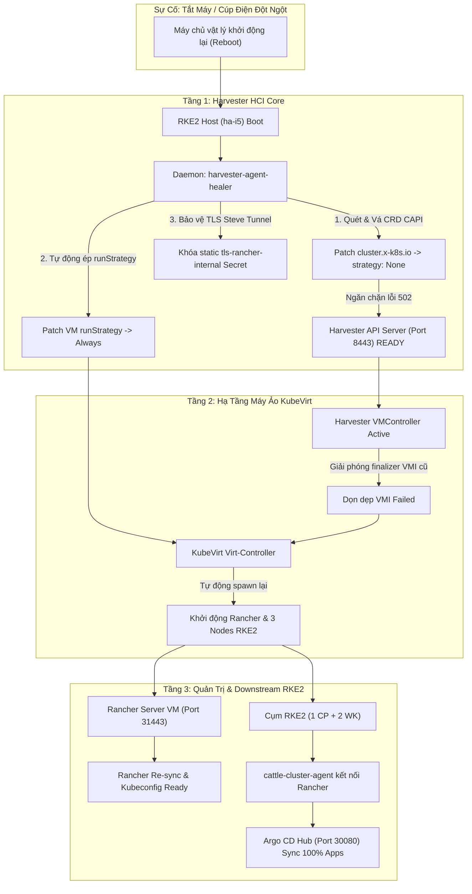

# Hướng Dẫn Tự Phục Hồi & Tự Động Hóa Vận Hành (Self-Healing Guide)

Tài liệu này giải thích chi tiết cơ chế **Tự Phục Hồi Toàn Diện (Full Self-Healing Architecture)** của hệ thống Lab Harvester + Rancher + RKE2, đảm bảo toàn bộ hệ thống tự động hoạt động ổn định 100% sau mỗi lần khởi động lại, cúp điện hoặc tắt máy đột ngột mà **không cần can thiệp thủ công**.

---

## 1. Kiến Trúc Tự Phục Hồi Đa Tầng (Multi-Tier Self-Healing)



---

## 2. Chi Tiết Các Cơ Chế Tự Phục Hồi

### Tầng 1: Triệt tiêu vĩnh viễn lỗi 502 Harvester Web UI (CRD CAPI Healing)
- **Bản chất lỗi**: 
  - Trước đây, một số Custom Resource Definition thuộc nhóm `cluster.x-k8s.io` (như `machines`, `clusters`, `machinedeployments`) có khai báo `spec.conversion.strategy: Webhook` trỏ tới `capi-webhook-service.cattle-capi-system.svc:443`.
  - Do service này không tồn tại, reflector cache của Harvester API Server bị lỗi kết nối liên tục, khiến tiến trình khởi động bị nghẽn và **không bao giờ mở cổng HTTPS 8443**. Nginx Ingress nhận phản hồi `Connection refused` $\rightarrow$ Trả về **`502 Bad Gateway`**.
- **Giải pháp Tự Phục Hồi**:
  - Daemon [`harvester-agent-healer`](file:///Users/timi/lab/lab-harvester/gitops/infrastructure/rancher-server/05-harvester-agent-healer.yaml) chạy thường trực ngầm trên cụm Harvester.
  - Mỗi chu kỳ 15 giây, Healer tự động rà soát toàn bộ CRD trong cụm. Nếu phát hiện bất kỳ CRD `cluster.x-k8s.io` nào có `strategy: Webhook`, Healer sẽ **tự động patch về `strategy: None`** ngay lập tức.
  - Ngăn ngừa hoàn toàn nguy cơ lỗi 502 quay trở lại ngay cả sau khi nâng cấp hệ thống hoặc cài đè manifest.

---

### Tầng 2: Khôi phục máy ảo tự động sau cúp điện (`runStrategy: Always`)
- **Bản chất lỗi**:
  - Mặc định các máy ảo dùng `runStrategy: RerunOnFailure`. Khi mất điện hoặc tắt máy đột ngột, instance trước đó bị KubeVirt ghi nhận là `Phase: Failed`.
  - Nếu Harvester Controller bị nghẽn, finalizer `wrangler.cattle.io/VMController.BackfillObservedNetworkMacAddress` không được gỡ bỏ, khiến máy ảo bị kẹt vĩnh viễn ở trạng thái `Stopped`.
- **Giải pháp Tự Phục Hồi**:
  - Chuyển `runStrategy: Always` trong [`gitops/infrastructure/rancher-server/03-vm.yaml`](file:///Users/timi/lab/lab-harvester/gitops/infrastructure/rancher-server/03-vm.yaml).
  - Với chế độ `Always`, KubeVirt bắt buộc phải duy trì trạng thái chạy cho máy ảo bất kể nguyên nhân dừng trước đó.
  - Daemon Healer tự động kiểm tra và nâng cấp toàn bộ VM trong namespace `default` lên chế độ `Always`.
  - Khi Harvester API hoạt động bình thường, VMController tự động xóa VMI cũ trong 2 giây và khởi động lại toàn bộ máy ảo.

---

### Tầng 3: Tự chữa lành chứng chỉ nội bộ Rancher Agent (Steve Tunnel)
- **Bản chất lỗi**:
  - Gói đăng ký `cattle-cluster-agent` mặc định sinh chứng chỉ động (dynamiclistener). Khi IP cụm thay đổi hoặc khi khởi động lại, chứng chỉ này có thể bị mất SAN Node IP / VIP dẫn đến lỗi `503 Handler disconnected`.
- **Giải pháp Tự Phục Hồi**:
  - Daemon Healer tự động trích xuất CA nội bộ của Rancher, tổng hợp SAN IP (Node IP `192.168.250.2`, VIP `192.168.250.20`, ClusterIP), tự ký chứng chỉ và gắn cờ `listener.cattle.io/static: "true"`.
  - Đảm bảo kết nối giữa Harvester và Rancher Server không bao giờ bị đứt gãy.

---

## 3. Quy Trình Vận Hành Chuẩn (Best Practices)

### A. Quy trình Tắt máy an toàn (Graceful Shutdown)
Khi bạn chủ động muốn tắt máy chủ lab, **tránh bấm nút nguồn cứng hoặc ngắt cầu dao**. Hãy chạy 1 lệnh từ máy tính:

```bash
ssh rancher@192.168.250.2 "sudo poweroff"
```

**Lợi ích**:
1. Host gửi tín hiệu ACPI Shutdown tới tất cả các máy ảo KubeVirt.
2. Các máy ảo có 120 giây (`terminationGracePeriodSeconds: 120`) để flush dữ liệu bộ nhớ đệm xuống ổ cứng Longhorn, dừng `etcd` sạch sẽ và unmount filesystem an toàn.
3. Node Harvester tắt an toàn, loại trừ 100% lỗi phân mảnh dữ liệu hoặc tiến trình mồ côi.

---

### B. Quy trình Bật máy & Thời gian khởi động kỳ vọng
Khi bạn bật nguồn máy chủ vật lý, toàn bộ hạ tầng sẽ tuần tự tự phục hồi theo mốc thời gian:

| Mốc thời gian | Sự kiện diễn ra | Trạng thái kiểm tra |
| :--- | :--- | :--- |
| **00:00 - 01:30** | Máy chủ vật lý boot Linux, RKE2 host khởi động | Node `ha-i5` chuyển sang `Ready` |
| **01:30 - 02:00** | Healer daemon tự kiểm tra CRD & chứng chỉ | [http://192.168.250.2/](http://192.168.250.2/) sẵn sàng (`200 OK`) |
| **02:00 - 03:00** | KubeVirt tự động bật 4 máy ảo hạ tầng | 4/4 VM chuyển sang `Running` |
| **03:00 - 04:00** | Rancher Server VM nạp cơ sở dữ liệu K3s & web UI | [https://rancher.192.168.250.2.sslip.io:31443](https://rancher.192.168.250.2.sslip.io:31443) sẵn sàng |
| **04:00 - 05:00** | Cụm downstream RKE2 khởi động xong etcd & kết nối | [http://192.168.250.2:30080](http://192.168.250.2:30080) (Argo CD) đồng bộ Healthy |

> [!NOTE]
> Bạn chỉ cần đợi khoảng **3 đến 5 phút** sau khi bật nguồn, tất cả dịch vụ sẽ tự động trực tuyến đầy đủ mà không cần gõ bất kỳ lệnh nào.

---

## 4. Bảng Tra Cứu Xử Lý Nhanh (Troubleshooting Cheatsheet)

Nếu sau 5 phút vẫn chưa truy cập được một dịch vụ cụ thể:

### 1. Kiểm tra trạng thái máy ảo trên Harvester
```bash
kubectl --kubeconfig=kubeconfig.yaml get vms,vmi -A
```
*Tất cả phải hiển thị `STATUS: Running` và `READY: True`.*

### 2. Kiểm tra log của Auto-Healer Daemon
```bash
kubectl --kubeconfig=kubeconfig.yaml logs -n default -l app=harvester-agent-healer --tail=50
```

### 3. Kiểm tra cụm Rancher & RKE2 Downstream
```bash
ssh -p 31022 opensuse@192.168.250.2 "sudo /usr/local/bin/k3s kubectl get clusters.management.cattle.io"
```
*Cả 3 cụm `harvester-local`, `rke2-lab`, `local` phải hiển thị `READY: True`.*
