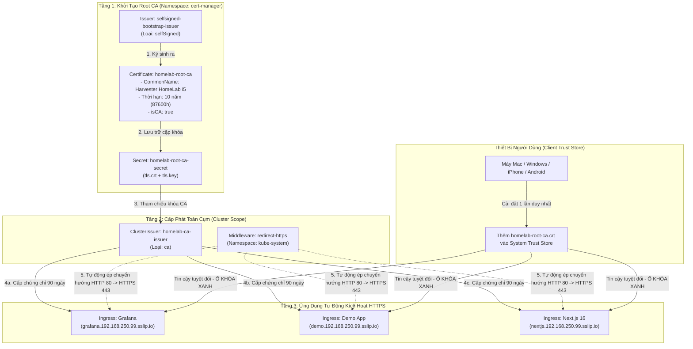

# Hướng Dẫn Toàn Diện Về Cert-Manager & ClusterIssuer (Mô Hình 2-Tier Local Root CA)

Tài liệu này cung cấp hướng dẫn chi tiết về kiến trúc hạ tầng khóa công khai (PKI), cơ chế cấp phát chứng chỉ tự động bằng **cert-manager**, quy trình triển khai **ClusterIssuer nội bộ (Harvester HomeLab i5)** qua **Argo CD Hub**, và lộ trình nâng cấp lên **Let's Encrypt Cloudflare DNS-01** khi sở hữu tên miền riêng.

---

## 1. Tổng Quan Về Bảo Mật TLS/HTTPS Trong Homelab

Trong môi trường Homelab hướng tới chuẩn Production:
* **Nguy cơ khi dùng HTTP thường (Port 80)**: Các dịch vụ như Grafana, Next.js, Argo CD và các ứng dụng nghiệp vụ khi đăng nhập sẽ truyền tải Cookie, Token xác thực và Mật khẩu dưới dạng văn bản thuần (plain text) trên mạng LAN. Bất kỳ thiết bị nào trong mạng (camera IoT, điện thoại, máy tính khách) đều có thể bắt gói tin nếu bị xâm nhập.
* **Giải pháp**: Tự động hóa mã hóa toàn bộ lưu lượng qua giao thức **HTTPS (Port 443)** bằng **cert-manager** và **Traefik Ingress Controller**.

---

## 2. Kiến Trúc Cấp Phát Chứng Chỉ 2 Tầng (2-Tier Local Root CA)

Hệ thống sử dụng mô hình **Root CA 2 tầng** thay vì Self-Signed đơn lẻ:



### Tại sao lại dùng mô hình Root CA 2 tầng?
1. **Ổ khóa xanh vĩnh viễn (Green Lock)**: Bạn chỉ cần cài file Root CA `Harvester HomeLab i5` vào máy tính/điện thoại **1 lần duy nhất**. Từ đó về sau, mọi trang web nội bộ bạn tạo ra trong cụm Kubernetes đều sẽ hiện ổ khóa xanh bảo mật, không bao giờ bị báo "Not Secure".
2. **Tự động gia hạn (Zero-Touch Auto-Renewal)**: Các chứng chỉ con của ứng dụng (Leaf Certificates) có hạn 90 ngày và được cert-manager tự động gia hạn trước khi hết hạn 30 ngày.
3. **Phạm vi toàn cụm (Cluster-wide)**: Nhờ dùng `ClusterIssuer`, bạn có thể tạo Ingress ở bất kỳ Namespace nào (`monitoring`, `demo-app`, `production`, v.v.) mà không cần cấu hình lại CA.

---

## 3. Cấu Trúc File GitOps & Vai Trò Từng Thành Phần

```text
gitops/
├── applications/
│   ├── 03-platform.yaml                 # Cài đặt cert-manager Helm chart (Sync Wave: 1)
│   ├── 03a-cluster-issuers.yaml         # Triển khai Root CA & ClusterIssuer (Sync Wave: 2)
│   └── 03b-monitoring.yaml              # Triển khai Prometheus/Grafana bật TLS (Sync Wave: 3)
└── platform/
    └── cluster-issuers/
        ├── 01-selfsigned-bootstrap.yaml # Bootstrap Issuer tự ký
        ├── 02-root-ca.yaml              # Yêu cầu sinh Root CA "Harvester HomeLab i5" 10 năm
        ├── 03-cluster-issuer.yaml       # ClusterIssuer "homelab-ca-issuer" dùng chung
        ├── 04-traefik-middleware.yaml   # Traefik Middleware redirect HTTP -> HTTPS
        ├── kustomization.yaml           # Quản lý tài nguyên Kustomize
        └── export-ca.sh                 # Script tiện ích xuất file Root CA
```

---

## 4. Hướng Dẫn Cài Đặt File Root CA Lên Thiết Bị Cá Nhân

Để trình duyệt (Chrome, Safari, Firefox, Edge) trên máy của bạn hiện **ổ khóa xanh bảo mật** cho tất cả các trang web nội bộ:

### Bước 1: Xuất file chứng chỉ Root CA
Chạy script tự động có sẵn trong thư mục dự án:
```bash
./gitops/platform/cluster-issuers/export-ca.sh
```
File `homelab-root-ca.crt` sẽ được xuất ra ngay tại thư mục gốc repository.

---

### Bước 2: Thêm vào danh sách tin cậy (Trust Store)

#### 🍎 Trên macOS
Mở terminal trên máy Mac và chạy lệnh (yêu cầu quyền sudo):
```bash
sudo security add-trusted-cert -d -r trustRoot -k /Library/Keychains/System.keychain homelab-root-ca.crt
```
*(Hoặc mở ứng dụng **Keychain Access** -> Kéo thả file `homelab-root-ca.crt` vào mục **System** -> Nhấp đúp vào chứng chỉ "Harvester HomeLab i5" -> Mở rộng mục **Trust** -> Chọn **Always Trust**).*

#### 🪟 Trên Windows
1. Nhấp đúp vào file `homelab-root-ca.crt`.
2. Bấm **Install Certificate...** -> Chọn **Local Machine** -> Bấm **Next**.
3. Chọn tùy chọn **Place all certificates in the following store**.
4. Bấm **Browse...** -> Chọn thư mục **Trusted Root Certification Authorities** -> Bấm **OK** -> Bấm **Finish**.

#### 🐧 Trên Linux (Ubuntu / Debian)
```bash
sudo cp homelab-root-ca.crt /usr/local/share/ca-certificates/homelab-root-ca.crt
sudo update-ca-certificates
```

#### 📱 Trên iPhone / iPad (iOS)
1. Gửi file `homelab-root-ca.crt` qua AirDrop hoặc tải qua Email/Google Drive.
2. Vào **Cài đặt (Settings)** -> Chọn **Đã tải về hồ sơ (Profile Downloaded)** -> Bấm **Cài đặt (Install)**.
3. Vào **Cài đặt chung (General)** -> **Giới thiệu (About)** -> **Cài đặt tin cậy chứng nhận (Certificate Trust Settings)** -> Bật công tắc tin cậy hoàn toàn cho **Harvester HomeLab i5**.

---

## 5. Hướng Dẫn Kích Hoạt HTTPS Cho Ingress Mới

Khi bạn tạo bất kỳ ứng dụng mới nào (ví dụ Home Assistant, Vaultwarden), chỉ cần cấu hình Ingress theo mẫu chuẩn sau:

```yaml
apiVersion: networking.k8s.io/v1
kind: Ingress
metadata:
  name: my-app
  namespace: my-app
  annotations:
    # 1. Kích hoạt tự động cấp chứng chỉ từ ClusterIssuer
    cert-manager.io/cluster-issuer: homelab-ca-issuer
    
    # 2. Lắng nghe trên cả cổng HTTP (web) và HTTPS (websecure)
    traefik.ingress.kubernetes.io/router.entrypoints: web,websecure
    
    # 3. Ép chuyển hướng toàn bộ traffic HTTP cổng 80 sang HTTPS cổng 443
    traefik.ingress.kubernetes.io/router.middlewares: kube-system-redirect-https@kubernetescrd
spec:
  ingressClassName: traefik
  # 4. Cấu hình Secret lưu chứng chỉ TLS
  tls:
    - hosts:
        - my-app.192.168.250.99.sslip.io
      secretName: my-app-tls
  rules:
    - host: my-app.192.168.250.99.sslip.io
      http:
        paths:
          - path: /
            pathType: Prefix
            backend:
              service:
                name: my-app
                port:
                  number: 8080
```

---

## 6. Lộ Trình Tương Lai: Nâng Cấp Let's Encrypt (Cloudflare DNS-01)

Khi bạn mua một tên miền riêng (ví dụ `yourdomain.com`) và quản lý DNS trên **Cloudflare**, bạn có thể cấp chứng chỉ SSL thật của Let's Encrypt cho cụm Homelab thông qua giao thức **DNS-01 Challenge** mà **không cần mở bất kỳ cổng nào ra ngoài Internet**.

### Bước 1: Tạo Cloudflare API Token
1. Đăng nhập Cloudflare -> **My Profile** -> **API Tokens** -> **Create Token**.
2. Chọn template **Edit zone DNS** -> Chọn đúng Zone domain của bạn -> Bấm lưu và copy mã token.

### Bước 2: Mã hóa Secret bằng SOPS
Tạo file Secret chứa token và mã hóa bằng SOPS (`.sops.yaml`):
```yaml
apiVersion: v1
kind: Secret
metadata:
  name: cloudflare-api-token-secret
  namespace: cert-manager
type: Opaque
stringData:
  api-token: "YOUR_CLOUDFLARE_API_TOKEN_HERE"
```

### Bước 3: Tạo ClusterIssuer Let's Encrypt
Tạo thêm file `05-letsencrypt-prod.yaml` vào thư mục `gitops/platform/cluster-issuers/`:

```yaml
apiVersion: cert-manager.io/v1
kind: ClusterIssuer
metadata:
  name: letsencrypt-prod
spec:
  acme:
    server: https://acme-v02.api.letsencrypt.org/directory
    email: your-email@example.com
    privateKeySecretRef:
      name: letsencrypt-prod-account-key
    solvers:
    - dns01:
        cloudflare:
          apiTokenSecretRef:
            name: cloudflare-api-token-secret
            key: api-token
```

> [!TIP]
> **Chạy song song 2 ClusterIssuer:**
> Cụm Kubernetes hỗ trợ chạy song song nhiều `ClusterIssuer`. Khi đó:
> - Các app nội bộ dùng domain `*.sslip.io` vẫn dùng `cert-manager.io/cluster-issuer: homelab-ca-issuer`.
> - Các app dùng tên miền riêng `*.lab.yourdomain.com` chỉ cần đổi annotation thành `cert-manager.io/cluster-issuer: letsencrypt-prod`!

---

## 7. Các Lệnh Kiểm Tra & Xử Lý Sự Cố (Troubleshooting)

```bash
KUBECONFIG_RKE2="./gitops/infrastructure/rke2-cluster/rke2-kubeconfig.yaml"

# 1. Kiểm tra trạng thái ClusterIssuer
kubectl --kubeconfig=$KUBECONFIG_RKE2 get clusterissuer

# 2. Kiểm tra toàn bộ chứng chỉ và ngày hết hạn
kubectl --kubeconfig=$KUBECONFIG_RKE2 get certificate -A

# 3. Kiểm tra Secret chứa chứng chỉ TLS đã được sinh ra chưa
kubectl --kubeconfig=$KUBECONFIG_RKE2 get secret -A -l cert-manager.io/certificate-name

# 4. Kiểm tra sự kiện cấp chứng chỉ chi tiết khi gặp lỗi
kubectl --kubeconfig=$KUBECONFIG_RKE2 describe certificaterequest -A

# 5. Kiểm tra tính năng chuyển hướng HTTP sang HTTPS từ terminal
curl -I http://grafana.192.168.250.99.sslip.io
# Kết quả mong muốn: HTTP/1.1 301 Moved Permanently -> Location: https://grafana.192.168.250.99.sslip.io/
```
