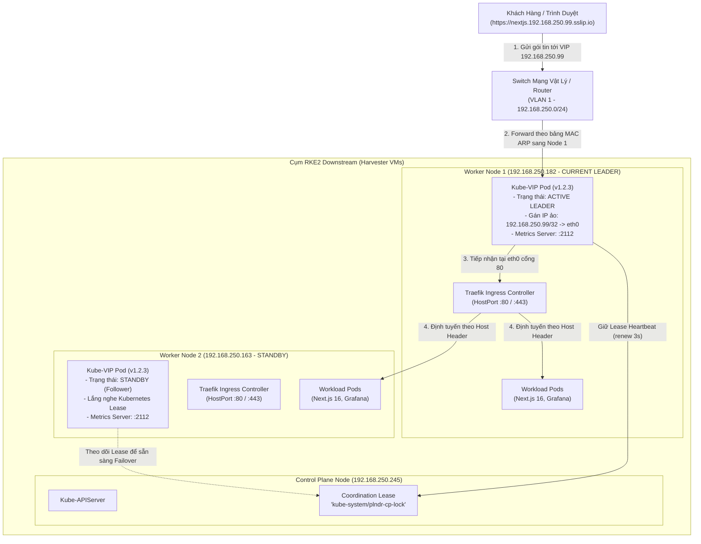

# Hướng Dẫn Toàn Diện Về Kube-VIP Trong Cụm Harvester RKE2

Tài liệu này cung cấp hướng dẫn chi tiết về kiến trúc, cơ chế hoạt động mạng ảo, các tệp kê khai (manifests), tích hợp giám sát **Prometheus** và sổ tay vận hành / xử lý sự cố cho **Kube-VIP** trên cụm **RKE2 Downstream** thuộc hệ sinh thái **Harvester GitOps**.

---

## 1. Tổng Quan & Bài Toán Cần Giải Quyết

### 1.1. Thách thức mạng trong mô hình ảo hóa Harvester
Trong cụm Kubernetes downstream RKE2 (`rke2-lab`) được tạo trên nền tảng Harvester HCI:
* Các máy ảo Worker node (`rke2-wk-config`) nhận IP động từ máy chủ DHCP mạng vật lý (dải mạng `192.168.250.0/24`).
* Khi worker node khởi động lại hoặc khi có node mới tham gia cụm, địa chỉ IP của worker có thể bị thay đổi hoặc luân chuyển.
* Nếu cấu hình Ingress (`Traefik`) trỏ trực tiếp vào IP của một worker cụ thể (hoặc DNS wildcard gắn cứng vào IP worker):
  - Khi worker đó bảo trì hoặc đổi IP, toàn bộ kết nối từ người dùng vào các dịch vụ Ingress (Next.js, Grafana, Demo App) sẽ **bị đứt đoạn hoàn toàn**.
  - Việc cấu hình nhiều bản ghi DNS gắn vào nhiều IP worker gây phức tạp và không hỗ trợ chuyển đổi dự phòng (failover) tức thời.

### 1.2. Giải pháp Kube-VIP (Virtual IP & ARP Mode)
**Kube-VIP** giải quyết triệt để bài toán trên bằng cách:
* Cung cấp một **Địa Chỉ IP Ảo Duy Nhất (Virtual IP - VIP)** cố định: `192.168.250.99`.
* Chạy dưới dạng **DaemonSet** trực tiếp trên các Worker Node với quyền mạng cấp hệ điều hành (`hostNetwork: true`, `NET_ADMIN`, `NET_RAW`).
* Sử dụng cơ chế **Bầu chọn Trưởng nhóm (Leader Election)** qua Kubernetes Lease: Tại một thời điểm, chỉ duy nhất **một worker node** giữ vai trò Leader sẽ gán địa chỉ IP `192.168.250.99` vào card mạng vật lý (`eth0`) và phát quảng bá gói tin **Gratuitous ARP (GARP)** ra toàn bộ switch mạng.
* Khi node Leader gặp sự cố, một worker node khác sẽ tự động nhận quyền Leader trong vòng **dưới 3 giây** và tiếp quản địa chỉ VIP mà không làm gián đoạn lưu lượng mạng của người dùng.

---

## 2. Kiến Trúc & Cơ Chế Hoạt Động (Architecture & Flow)

### 2.1. Sơ đồ Luồng Lưu Lượng Mạng (Traffic Flow)



### 2.2. Cơ Chế Bầu Chọn Leader (Kubernetes Lease Election)
* **Khóa điều phối (Coordination Lease)**: Kube-VIP sử dụng tài nguyên chuẩn `leases.coordination.k8s.io` có tên `plndr-cp-lock` đặt trong namespace `kube-system`.
* **Cơ chế gia hạn (Heartbeat Renewal)**:
  - `vip_leaseduration`: `5` giây (thời gian hiệu lực của khóa).
  - `vip_renewdeadline`: `3` giây (chu kỳ node Leader chủ động gia hạn khóa).
  - `vip_retryperiod`: `1` giây (chu kỳ các node thử thăm dò lại khi tranh quyền).
* **Quá trình Chuyển Giao Dự Phòng (Failover)**:
  1. Nếu Worker Node 1 bị tắt hoặc treo mạng, sau 5 giây khóa `plndr-cp-lock` sẽ hết hạn.
  2. Worker Node 2 lập tức phát hiện và gửi yêu cầu `Acquire Lease` thành công lên Kubernetes API Server.
  3. Worker Node 2 chạy câu lệnh gán IP `ip addr add 192.168.250.99/32 dev eth0`.
  4. Worker Node 2 phát một loạt gói tin **Gratuitous ARP (GARP)** ra mạng LAN để switch mạng cập nhật bảng MAC address trỏ địa chỉ `192.168.250.99` về card mạng của Worker Node 2.

---

## 3. Cấu Trúc Các Tệp Manifest GitOps

Tất cả các tài nguyên của Kube-VIP được quản lý tập trung theo mô hình GitOps tại thư mục [`gitops/platform/kube-vip/`](file:///Users/timi/lab/lab-harvester/gitops/platform/kube-vip/):

```text
gitops/platform/kube-vip/
├── kustomization.yaml     # Khai báo nạp các tệp manifest cho Kustomize
├── rbac.yaml              # Phân quyền ServiceAccount, ClusterRole & Binding
├── daemonset.yaml         # Khai báo DaemonSet chạy kube-vip v1.2.3 trên Worker nodes
└── podmonitor.yaml        # Tích hợp cào Prometheus metrics tự động qua cổng 2112
```

### 3.1. Phân tích chi tiết `daemonset.yaml`
Tệp [`daemonset.yaml`](file:///Users/timi/lab/lab-harvester/gitops/platform/kube-vip/daemonset.yaml) định nghĩa DaemonSet `kube-vip-ds` với các cấu hình then chốt:

```yaml
apiVersion: apps/v1
kind: DaemonSet
metadata:
  name: kube-vip-ds
  namespace: kube-system
  labels:
    app.kubernetes.io/name: kube-vip
spec:
  selector:
    matchLabels:
      name: kube-vip-ds
  template:
    metadata:
      labels:
        name: kube-vip-ds
        app.kubernetes.io/name: kube-vip
    spec:
      affinity:
        nodeAffinity:
          requiredDuringSchedulingIgnoredDuringExecution:
            nodeSelectorTerms:
            - matchExpressions:
              - key: node-role.kubernetes.io/worker
                operator: Exists
      containers:
      - name: kube-vip
        image: ghcr.io/kube-vip/kube-vip:v1.2.3
        imagePullPolicy: IfNotPresent
        args:
        - manager
        ports:
        - name: metrics
          containerPort: 2112
          protocol: TCP
        env:
        - name: prometheus_server
          value: ":2112"
        - name: vip_arp
          value: "true"
        - name: port
          value: "80"
        - name: vip_interface
          value: "eth0"
        - name: node_name
          valueFrom:
            fieldRef:
              fieldPath: spec.nodeName
        - name: cp_enable
          value: "true"
        - name: cp_namespace
          value: "kube-system"
        - name: svc_enable
          value: "false"
        - name: vip_leaderelection
          value: "true"
        - name: vip_leaseduration
          value: "5"
        - name: vip_renewdeadline
          value: "3"
        - name: vip_retryperiod
          value: "1"
        - name: address
          value: "192.168.250.99"
        securityContext:
          capabilities:
            add:
            - NET_ADMIN
            - NET_RAW
            - SYS_TIME
        resources:
          requests:
            cpu: 25m
            memory: 32Mi
          limits:
            cpu: 100m
            memory: 128Mi
      hostNetwork: true
      serviceAccountName: kube-vip
```

#### Bảng ý nghĩa các tham số cấu hình:
| Biến môi trường / Thuộc tính | Giá trị | Giải thích chức năng |
| :--- | :--- | :--- |
| `image` | `ghcr.io/kube-vip/kube-vip:v1.2.3` | Bản release chính thức mới nhất, khắc phục các vấn đề liên quan đến lease và BGP metrics. |
| `nodeAffinity` | `node-role.../worker: Exists` | Chỉ lập lịch chạy Kube-VIP trên các Worker Node (nơi Traefik Ingress lắng nghe traffic). |
| `hostNetwork: true` | `true` | Cho phép container can thiệp trực tiếp vào ngăn xếp mạng của máy chủ để gán IP vào card mạng vật lý. |
| `capabilities` | `NET_ADMIN`, `NET_RAW`, `SYS_TIME` | Cung cấp đặc quyền Linux cần thiết để gửi gói tin ARP raw và gán địa chỉ IP. |
| `vip_arp` | `"true"` | Kích hoạt chế độ ARP Layer-2 (phù hợp mạng phẳng nội bộ VLAN 1). |
| `vip_interface` | `"eth0"` | Tên card mạng vật lý của các máy ảo openSUSE Leap Micro trong Harvester. |
| `address` | `"192.168.250.99"` | Địa chỉ VIP ảo được Kube-VIP quản lý và cấp phát. |
| `port` | `"80"` | Cổng dịch vụ lắng nghe kiểm tra sức khỏe của VIP. |
| `cp_enable` | `"true"` | Kích hoạt chức năng Control Plane / VIP Manager. |
| `svc_enable` | `"false"` | Tắt chế độ LoadBalancer cho Service Type=LoadBalancer (vì cụm sử dụng Ingress Traefik HostPort). |
| `prometheus_server` | `":2112"` | Mở HTTP server xuất bản số liệu giám sát chuẩn Prometheus tại cổng 2112. |

---

### 3.2. Phân tích `rbac.yaml`
Tệp [`rbac.yaml`](file:///Users/timi/lab/lab-harvester/gitops/platform/kube-vip/rbac.yaml) cấp quyền tối thiểu cần thiết cho ServiceAccount `kube-vip`:
* Quyền đọc/ghi tài nguyên `leases` trong nhóm `coordination.k8s.io` để thực hiện Leader Election.
* Quyền theo dõi `nodes`, `endpoints`, `endpointslices` và `services`.

---

### 3.3. Phân tích `podmonitor.yaml`
Tệp [`podmonitor.yaml`](file:///Users/timi/lab/lab-harvester/gitops/platform/kube-vip/podmonitor.yaml) tích hợp Kube-VIP trực tiếp vào cụm giám sát `kube-prometheus-stack`:

```yaml
apiVersion: monitoring.coreos.com/v1
kind: PodMonitor
metadata:
  name: kube-vip
  namespace: kube-system
  labels:
    app.kubernetes.io/name: kube-vip
    release: kube-prometheus-stack
spec:
  selector:
    matchLabels:
      app.kubernetes.io/name: kube-vip
  podMetricsEndpoints:
    - port: metrics
      interval: 15s
      path: /metrics
```
* **Nhãn `release: kube-prometheus-stack`**: Bắt buộc phải có để Prometheus Operator tự động nạp target cào dữ liệu từ tất cả các Pod Kube-VIP trong namespace `kube-system`.

---

## 4. Tích Hợp Giám Sát Prometheus (Metrics Port :2112)

Kể từ bản `v1.x`, Kube-VIP tích hợp sẵn Prometheus HTTP Server. Mỗi pod Kube-VIP mở cổng `:2112` trên chính IP của node tương ứng.

### 4.1. Các chỉ số quan trọng (Key Metrics)
| Metric Name | Loại | Mô tả & Ý nghĩa giám sát |
| :--- | :--- | :--- |
| `kube_vip_build_info` | Gauge | Phiên bản, commit SHA và tên node đang chạy. Giá trị hiển thị `0` hoặc `1`. |
| `kube_vip_is_leader` | Gauge | Trả về `1` nếu node đó hiện đang là Leader giữ VIP, `0` nếu là Standby. Cực kỳ hữu ích để hiển thị trạng thái Active/Standby trên Grafana. |
| `kube_vip_leader_election_transitions_total` | Counter | Tổng số lần chuyển giao quyền Leader giữa các node. Nếu chỉ số này tăng liên tục cảnh báo hiện tượng mạng chập chờn (VIP flapping). |
| `kube_vip_service_reconcile_errors_total` | Counter | Số lỗi trong quá trình điều hòa dịch vụ VIP. |

### 4.2. Kiểm tra Metrics từ dòng lệnh
Bạn có thể kiểm tra trực tiếp từ máy trạm hoặc trong mạng LAN:

```bash
# 1. Kiểm tra metrics từ địa chỉ VIP (trả về metrics của node Leader hiện tại)
curl -s http://192.168.250.99:2112/metrics | grep -E "^kube_vip_"

# 2. Kiểm tra trực tiếp trên từng Worker Node
curl -s http://192.168.250.182:2112/metrics | grep "kube_vip_build_info"
curl -s http://192.168.250.163:2112/metrics | grep "kube_vip_build_info"
```

---

## 5. Sổ Tay Vận Hành (Operations Playbook)

### 5.1. Cách kiểm tra ai đang là Leader của VIP
Có 3 cách nhanh chóng để xác định worker nào đang giữ VIP:

#### Cách 1: Đọc tài nguyên Lease trong Kubernetes (Khuyên dùng)
```bash
KUBECONFIG=gitops/infrastructure/rke2-cluster/rke2-kubeconfig.yaml \
kubectl get lease plndr-cp-lock -n kube-system -o yaml
```
* Trường `spec.holderIdentity` sẽ hiển thị chính xác tên node Leader (ví dụ: `rke2-lab-wk-5mhbb-s4ktz`).

#### Cách 2: Xem Logs của DaemonSet
```bash
KUBECONFIG=gitops/infrastructure/rke2-cluster/rke2-kubeconfig.yaml \
kubectl logs -n kube-system -l name=kube-vip-ds --tail=20 | grep -E "New leader|Successfully acquired lease"
```

#### Cách 3: Tra cứu bảng ARP trên máy trạm
```bash
arp -an | grep 192.168.250.99
```
* Đối chiếu địa chỉ MAC với MAC của các máy ảo Worker trên bảng điều khiển Harvester HCI.

---

### 5.2. Quy trình đổi địa chỉ IP VIP (Ví dụ: từ IP cũ sang IP mới)

Khi cần quy hoạch lại địa chỉ mạng hoặc đổi VIP:

> [!IMPORTANT]
> Trước khi đổi VIP, **BẮT BUỘC** phải kiểm tra xem địa chỉ IP mới có đang bị thiết bị nào khác chiếm dụng không bằng cách chạy `arping` hoặc `ping`. Địa chỉ mới phải nằm ngoài dải cấp phát DHCP của router.

**Bước 1: Kiểm tra an toàn mạng**
```bash
# Đảm bảo IP mới hoàn toàn không phản hồi
ping -c 2 192.168.250.<NEW_IP>
```

**Bước 2: Cập nhật cấu hình trong GitOps**
1. Cập nhật `address: "192.168.250.<NEW_IP>"` trong [`daemonset.yaml`](file:///Users/timi/lab/lab-harvester/gitops/platform/kube-vip/daemonset.yaml).
2. Cập nhật các bản ghi Ingress trỏ về IP mới:
   - Ingress Demo App: [`gitops/workloads/demo-app/ingress.yaml`](file:///Users/timi/lab/lab-harvester/gitops/workloads/demo-app/ingress.yaml) trỏ về `demo.192.168.250.<NEW_IP>.sslip.io`.
   - Ingress Next.js: [`gitops/workloads/demo-nextjs-16/ingress.yaml`](file:///Users/timi/lab/lab-harvester/gitops/workloads/demo-nextjs-16/ingress.yaml) trỏ về `nextjs.192.168.250.<NEW_IP>.sslip.io`.
   - Ingress Grafana: [`gitops/applications/03b-monitoring.yaml`](file:///Users/timi/lab/lab-harvester/gitops/applications/03b-monitoring.yaml) trỏ về `grafana.192.168.250.<NEW_IP>.sslip.io`.

**Bước 3: Commit & Push Git**
```bash
git add gitops/
git commit -m "feat(network): migrate VIP to 192.168.250.<NEW_IP>"
git push origin main
```
* ArgoCD sẽ tự động rollout Kube-VIP và cập nhật Ingress. Node Leader sẽ lập tức giải phóng IP cũ và bind IP mới.

---

### 5.3. Quy trình Nâng Cấp Phiên Bản Kube-VIP

1. Kiểm tra tag phiên bản mới trên [Kube-VIP GitHub Releases](https://github.com/kube-vip/kube-vip/releases).
2. Thay đổi giá trị `image: ghcr.io/kube-vip/kube-vip:<NEW_TAG>` trong [`daemonset.yaml`](file:///Users/timi/lab/lab-harvester/gitops/platform/kube-vip/daemonset.yaml).
3. Commit và đẩy lên Git.
4. Theo dõi quá trình RollingUpdate:
   ```bash
   KUBECONFIG=gitops/infrastructure/rke2-cluster/rke2-kubeconfig.yaml \
   kubectl rollout status daemonset/kube-vip-ds -n kube-system
   ```

---

## 6. Xử Lý Sự Cố Thường Gặp (Troubleshooting Guide)

### 6.1. Lỗi: Không thể Ping hoặc kết nối tới địa chỉ VIP (`192.168.250.99`)
* **Nguyên nhân 1: Xung đột IP (IP Conflict)**
  - Nếu router hoặc một máy khác trong mạng LAN vô tình nhận cùng IP `.99`, switch sẽ forward sai gói tin.
  - *Khắc phục*: Tắt tạm thời pod kube-vip (`kubectl scale ds kube-vip-ds --replicas=0`) rồi ping IP `.99`. Nếu vẫn có phản hồi nghĩa là có thiết bị ngoài mạng đang dùng trộm IP này.
* **Nguyên nhân 2: Sai tên card mạng `vip_interface`**
  - Mặc định máy ảo trong Harvester dùng card mạng `eth0`. Nếu hệ điều hành sử dụng tên khác (ví dụ `ens3`, `enp0s3`), Kube-VIP sẽ không thể gán IP.
  - *Khắc phục*: Kiểm tra lệnh `ip link show` trên worker node và chỉnh lại `vip_interface` trong `daemonset.yaml`.
* **Nguyên nhân 3: Pod Kube-VIP chưa acquire được Lease**
  - Kiểm tra log của pod: `kubectl logs -n kube-system -l name=kube-vip-ds`. Nếu thấy báo lỗi `permission denied` hoặc `failed to acquire lease`, kiểm tra lại tài nguyên [`rbac.yaml`](file:///Users/timi/lab/lab-harvester/gitops/platform/kube-vip/rbac.yaml).

### 6.2. Lỗi: VIP Ping được nhưng Web Ingress báo `Connection Refused` hoặc `Timeout`
* **Nguyên nhân**: VIP đã được gán vào node Leader, nhưng Traefik Ingress Controller trên node đó không lắng nghe trên cổng 80/443.
* **Khắc phục**:
  1. Kiểm tra Traefik pod trên node Leader:
     ```bash
     KUBECONFIG=gitops/infrastructure/rke2-cluster/rke2-kubeconfig.yaml \
     kubectl get pods -n kube-system -l app.kubernetes.io/name=rke2-traefik -o wide
     ```
  2. Đảm bảo Traefik pod đang ở trạng thái `Running` trên chính worker node đang giữ vai trò Kube-VIP Leader.

### 6.3. Lỗi: VIP Flapping (VIP liên tục nhảy giữa Worker 1 và Worker 2)
* **Nguyên nhân**: Mạng giữa các worker node và control plane bị nghẽn dẫn đến việc gia hạn lease (`renewDeadline: 3s`) bị trễ quá thời gian `leaseDuration: 5s`.
* **Khắc phục**: Tăng các giá trị `vip_leaseduration` lên `10s`, `vip_renewdeadline` lên `6s` trong [`daemonset.yaml`](file:///Users/timi/lab/lab-harvester/gitops/platform/kube-vip/daemonset.yaml).

---

## 7. Tổng Kết

Kube-VIP cung cấp giải pháp cân bằng tải ảo Layer-2 cực kỳ gọn nhẹ, không phụ thuộc vào hạ tầng đám mây công cộng (Cloud Provider độc lập), đặc biệt lý tưởng cho môi trường On-Premises HCI như Harvester. Nhờ cơ chế GitOps và Prometheus PodMonitor, toàn bộ vòng đời của VIP từ triển khai, nâng cấp đến giám sát sức khỏe đều được tự động hóa hoàn toàn.
