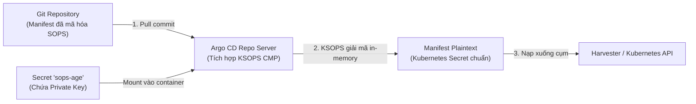

# Hướng Dẫn Toàn Diện Về SOPS, Age Key & KSOPS

Tài liệu này cung cấp hướng dẫn chi tiết về cách quản lý bí mật (Secrets), cấu hình [`.sops.yaml`](file:///Users/timi/lab/lab-harvester/.sops.yaml), quản lý khóa **Age**, và quy trình giải mã tự động qua **KSOPS** trên **Argo CD Hub** trong hệ sinh thái **Harvester GitOps**.

---

## 1. Tổng Quan Về SOPS & Age Trong GitOps

Trong mô hình GitOps, nguyên tắc cốt lõi là: **Toàn bộ cấu hình hệ thống phải được lưu trữ trong Git (Single Source of Truth)**. Tuy nhiên, các thông tin nhạy cảm (mật khẩu máy chủ, SSH private key, token API, Cloud-Init credential) tuyệt đối không được đưa lên Git ở dạng thô (plain text).

Để giải quyết bài toán này, dự án kết hợp bộ 3 công cụ:
* **SOPS (Secrets OPerationS)**: Công cụ mã hóa tệp tin chuyên dụng của Mozilla, hỗ trợ mã hóa có chọn lọc trên các file YAML/JSON (chỉ mã hóa trường dữ liệu nhạy cảm, giữ nguyên metadata).
* **Age**: Thuật toán mã hóa bất đối xứng hiện đại, đơn giản, tốc độ cao và bảo mật vượt trội (thay thế cho GPG/PGP truyền thống).
* **KSOPS (Kustomize SOPS)**: Plugin mở rộng cho Kustomize & Argo CD, giúp tự động giải mã các Secret đã mã hóa bằng SOPS ngay trước khi nạp vào Kubernetes.

---

## 2. Cấu Trúc & Vai Trò File `.sops.yaml`

File [`.sops.yaml`](file:///Users/timi/lab/lab-harvester/.sops.yaml) đặt tại thư mục gốc của repository đóng vai trò là "bản quy tắc" chỉ dẫn cho công cụ `sops` biết cách mã hóa các file trong dự án:

```yaml
creation_rules:
  - path_regex: .*\.yaml$
    encrypted_regex: '^(data|stringData)$'
    age: 'age1mock0000000000000000000000000000000000000000000000000000000'
```

### Giải thích các tham số:
| Tham số | Ý nghĩa | Chi tiết kỹ thuật |
| :--- | :--- | :--- |
| `creation_rules` | Danh sách quy tắc tạo | Định nghĩa các điều kiện áp dụng khi mã hóa file mới. |
| `path_regex` | Bộ lọc đường dẫn file | Biểu thức chính quy `.*\.yaml$` áp dụng cho tất cả các file có phần mở rộng là `.yaml`. |
| `encrypted_regex` | Bộ lọc trường cần mã hóa | `^(data|stringData)$` chỉ định SOPS **chỉ mã hóa giá trị của trường `data` và `stringData`**. |
| `age` | Khóa công khai (Public Key) | Chuỗi Age Public Key được dùng để mã hóa nội dung. |

### Tại sao chỉ mã hóa `data` và `stringData`?
Trong Kubernetes Secret:
* `apiVersion`, `kind`, `metadata.name`, `metadata.namespace` là các thông tin cấu trúc.
* Việc giữ nguyên cấu trúc này giúp Argo CD, Kustomize và Git vẫn phân tích cú pháp (parse) được tài nguyên, theo dõi được tên và namespace của Secret mà không làm lộ mật khẩu thật.

#### Minh họa trước và sau khi mã hóa:

**Trước khi mã hóa (Plaintext):**
```yaml
apiVersion: v1
kind: Secret
metadata:
  name: example-secret
  namespace: default
type: Opaque
stringData:
  password: "SuperSecretPassword123"
```

**Sau khi chạy `sops -e -i secret.yaml`:**
```yaml
apiVersion: v1
kind: Secret
metadata:
  name: example-secret
  namespace: default
type: Opaque
stringData:
  password: ENC[AES256_GCM,data:xyz123...,iv:...tag:...]
sops:
  kms: []
  age:
    - recipient: age1mock...
      enc: ...
  encrypted_regex: ^(data|stringData)$
  version: 3.9.x
```
*(Khối `sops:` ở cuối chứa siêu dữ liệu mã hóa, xác thực tính toàn vẹn MAC và thông tin khóa).*

---

## 3. Quy Tắc An Toàn Khi Làm Việc Với Git

### ✅ Những file BẮT BUỘC / NÊN commit lên Git:
1. **[`.sops.yaml`](file:///Users/timi/lab/lab-harvester/.sops.yaml)**: File này chỉ chứa **Age Public Key**, hoàn toàn an toàn để chia sẻ công khai. Khi commit file này, bất kỳ ai clone repo về máy cũng có thể dùng lệnh `sops` để mã hóa thêm file mới mà không cần xin key.
2. **Các file Secret đã được mã hóa bằng SOPS**: Ví dụ [`gitops/infrastructure/rancher-server/01-cloud-init.yaml`](file:///Users/timi/lab/lab-harvester/gitops/infrastructure/rancher-server/01-cloud-init.yaml) hoặc [`gitops/workloads/demo-app/secret-demo.yaml`](file:///Users/timi/lab/lab-harvester/gitops/workloads/demo-app/secret-demo.yaml).

### ⛔ Những file TUYỆT ĐỐI KHÔNG commit lên Git:
1. **Age Private Key (`keys.txt`)**: Bắt đầu bằng tiền tố `AGE-SECRET-KEY-1...`. Nếu private key này bị đẩy lên Git, bất kỳ ai cũng có thể giải mã toàn bộ secret của cụm hạ tầng.
2. **File cấu hình gốc chưa qua mã hóa**: Luôn kiểm tra `git diff` trước khi commit để đảm bảo dữ liệu mật khẩu đã ở dạng `ENC[...]`.
3. **Kubeconfig & Thông tin lab nhạy cảm**: File [`kubeconfig.yaml`](file:///Users/timi/lab/lab-harvester/kubeconfig.yaml) và [`INFO.md`](file:///Users/timi/lab/lab-harvester/INFO.md) (đã được cấu hình trong [`.gitignore`](file:///Users/timi/lab/lab-harvester/.gitignore)).

---

## 4. Quản Lý Vòng Đời Khóa Age (Key Lifecycle)

> [!NOTE]
> Mọi chuỗi khóa trong mục này được thể hiện dưới dạng ví dụ mẫu giả định (**mock placeholder**) để đảm bảo an toàn.

### 4.1. Cấu trúc cặp khóa Age
Một cặp khóa Age gồm:
* **Public Key**: Dạng `age1mock0000000000000000000000000000000000000000000000000000000` (dùng để mã hóa, an toàn khi công khai).
* **Private Key**: Dạng `AGE-SECRET-KEY-1MOCK0000000000000000000000000000000000000000000000000000000` (dùng để giải mã, phải giữ tuyệt đối bí mật).

### 4.2. Khởi tạo cặp khóa mới trên máy trạm
Nếu cần tạo một cặp khóa mới trên máy trạm (macOS/Linux):
```bash
# 1. Tạo thư mục cấu hình sops
mkdir -p ~/.config/sops/age

# 2. Sinh cặp khóa mới và lưu vào keys.txt
age-keygen -o ~/.config/sops/age/keys.txt

# 3. Phân quyền chỉ cho phép tài khoản hiện tại đọc file
chmod 600 ~/.config/sops/age/keys.txt
```

Để trích xuất **Public Key** từ file `keys.txt` hiện có:
```bash
age-keygen -y ~/.config/sops/age/keys.txt
```

### 4.3. Thiết lập biến môi trường
SOPS sẽ tự động tìm khóa tại đường dẫn mặc định `~/.config/sops/age/keys.txt`. Tuy nhiên, bạn nên khai báo biến môi trường trong file profile (`~/.zshrc` hoặc `~/.bashrc`):
```bash
export SOPS_AGE_KEY_FILE="$HOME/.config/sops/age/keys.txt"
```

### 4.4. Nạp Secret `sops-age` vào Harvester Cluster
Để Argo CD trên cụm Harvester có thể tự động giải mã, Private Key cần được nạp thành Secret `sops-age` trong namespace `argocd`:
```bash
./bootstrap/01-setup-sops-age.sh
```
*Script này sẽ đọc file `~/.config/sops/age/keys.txt` và nạp vào Secret `sops-age` trên Kubernetes.*

---

## 5. Cẩm Nang Lệnh CLI SOPS Thao Tác Thực Tế

### 5.1. Mã hóa file Secret mới (In-place Encrypt)
Sau khi tạo file manifest Secret thô, chạy lệnh:
```bash
sops -e -i path/to/my-secret.yaml
```
*Tham số `-e` là mã hóa (encrypt), `-i` là ghi đè trực tiếp lên file (in-place).*

### 5.2. Giải mã xem nhanh nội dung (Decrypted Dry-Run)
Để đọc nội dung gốc mà **không làm thay đổi** file trên đĩa:
```bash
sops -d path/to/my-secret.yaml
```

### 5.3. Chỉnh sửa trực tiếp file đã mã hóa (Interactive Edit)
Khi cần thêm hoặc sửa đổi mật khẩu trong một file đã mã hóa:
```bash
sops path/to/my-secret.yaml
```
*SOPS sẽ giải mã tạm thời và mở file trong trình soạn thảo mặc định (Nano, Vim hoặc VS Code). Khi bạn lưu và thoát, SOPS sẽ tự động tính toán lại MAC và mã hóa lại file với khóa ban đầu.*

### 5.4. Cập nhật lại khóa khi thay đổi `.sops.yaml` (Rekey)
Nếu bạn thay đổi Age Public Key trong file [`.sops.yaml`](file:///Users/timi/lab/lab-harvester/.sops.yaml) và muốn cập nhật lại các file Secret cũ:
```bash
sops updatekeys path/to/my-secret.yaml
```

---

## 6. Cơ Chế Giải Mã Tự Động Trên Argo CD (KSOPS)

### 6.1. Kiến trúc luồng giải mã


### 6.2. Cách khai báo Secret với KSOPS trong Kustomize
Trong thư mục ứng dụng (ví dụ: [`gitops/infrastructure/rancher-server/`](file:///Users/timi/lab/lab-harvester/gitops/infrastructure/rancher-server/)):
1. File generator [`ksops-secret.yaml`](file:///Users/timi/lab/lab-harvester/gitops/infrastructure/rancher-server/ksops-secret.yaml):
   ```yaml
   apiVersion: viaduct.ai/v1alpha1
   kind: ksops
   metadata:
     name: ksops-secret-generator
     annotations:
       config.kubernetes.io/function: |
         exec:
           path: ksops
   files:
     - 01-cloud-init.yaml
   ```
2. File [`kustomization.yaml`](file:///Users/timi/lab/lab-harvester/gitops/infrastructure/rancher-server/kustomization.yaml) gọi generator này qua:
   ```yaml
   generators:
     - ksops-secret.yaml
   ```
Argo CD Hub sẽ gọi KSOPS để giải mã file `01-cloud-init.yaml` và xuất ra Secret hoàn chỉnh mà không bao giờ lưu Secret dạng thô trên Git.

---

## 7. Khắc Phục Sự Cố Thường Gặp (Troubleshooting)

### Lỗi 1: `failed to get age recipient` hoặc `no keys found`
* **Nguyên nhân**: Máy trạm chưa có file khóa `~/.config/sops/age/keys.txt` hoặc biến môi trường `SOPS_AGE_KEY_FILE` chưa được export.
* **Cách xử lý**:
  ```bash
  export SOPS_AGE_KEY_FILE="$HOME/.config/sops/age/keys.txt"
  # Kiểm tra xem file có tồn tại không:
  test -f "$SOPS_AGE_KEY_FILE" && echo "Key file tồn tại" || echo "Thiếu file key!"
  ```

### Lỗi 2: Argo CD báo lỗi `ComparisonError: plugin KSOPS failed`
* **Nguyên nhân**: Secret `sops-age` chưa được tạo trong namespace `argocd` trên Harvester, hoặc Private Key trong Secret không khớp với Public Key dùng khi mã hóa.
* **Cách xử lý**:
  Chạy lại script bootstrap:
  ```bash
  ./bootstrap/01-setup-sops-age.sh
  ```
  Sau đó restart pod `argocd-repo-server` để nhận diện Secret mới:
  ```bash
  kubectl -n argocd rollout restart deployment argocd-repo-server
  ```

### Lỗi 3: Vô tình commit file chưa mã hóa lên Git
* **Cách xử lý ngay lập tức**:
  1. **Đổi mật khẩu/khóa bí mật** đã bị lộ vì lịch sử Git có thể đã ghi lại.
  2. Mã hóa file bằng lệnh `sops -e -i path/to/file.yaml`.
  3. Commit đè lại file và push lên Git.
