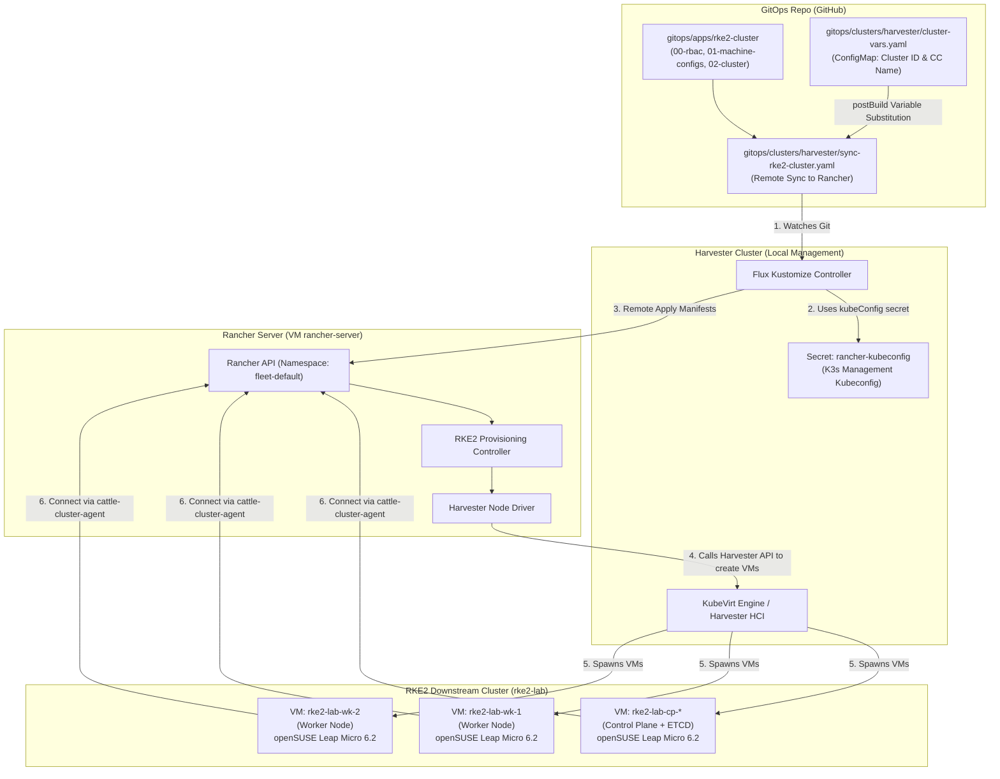

# Cụm RKE2 Downstream Trên Harvester HCI Quản Lý Bằng Rancher Node Driver & GitOps

Thư mục này chứa toàn bộ cấu hình khai báo dạng Infrastructure as Code (IaC) để Rancher tự động provision và quản lý vòng đời cụm **RKE2** (`rke2-lab`, hiện gồm 1 Control Plane + 2 Workers) chạy trên các máy ảo **openSUSE Leap Micro 6.2** của **Harvester HCI**.

Toàn bộ tài nguyên được triển khai **100% tự động qua GitOps** bằng cơ chế **Flux Multi-Cluster Remote Sync** — không cần chạy bất kỳ lệnh apply thủ công nào.

---

## 1. Thành phần cấu hình

| Tập tin | Chức năng |
| :--- | :--- |
| [`00-rbac.yaml`](file://gitops/apps/rke2-cluster/00-rbac.yaml) | Khai báo `ClusterRole` và `ClusterRoleBinding` cấp full quyền cho nhóm ServiceAccount `system:serviceaccounts:fleet-default` trên Rancher, đảm bảo Harvester Machine Provisioner có đủ quyền tạo và quản lý máy ảo. |
| [`01-machine-configs.yaml`](file://gitops/apps/rke2-cluster/01-machine-configs.yaml) | Khai báo 2 template `HarvesterConfig` (`rke2-cp-config`, `rke2-wk-config`): 2 vCPU, 4GB RAM, 40GB Disk, image `opensuse-leap-micro-62`, network `vlan1`, user `opensuse`, kèm `userData` kích hoạt `qemu-guest-agent` và host resolution `rancher.192.168.250.2.sslip.io`. Nhận biến `${HARVESTER_CLUSTER_ID}` động. |
| [`02-cluster.yaml`](file://gitops/apps/rke2-cluster/02-cluster.yaml) | Khai báo cụm RKE2 `rke2-lab` (namespace `fleet-default`, k8s `v1.36.4+rke2r1`) gồm pool `cp` (quantity: 1, roles: control-plane, etcd) và pool `wk` (quantity: 2, role: worker). Sử dụng biến `${HARVESTER_CLOUD_CREDENTIAL_SECRET_NAME}` động. |
| [`kustomization.yaml`](file://gitops/apps/rke2-cluster/kustomization.yaml) | Đóng gói toàn bộ tài nguyên trên để Flux đồng bộ tự động. |
| [`get-kubeconfig.sh`](file://gitops/apps/rke2-cluster/get-kubeconfig.sh) | Script tiện ích tự động lấy Kubeconfig cụm RKE2 từ Rancher về máy trạm Mac và chuẩn hóa endpoint Rancher Proxy NodePort. |

---

## 2. Kiến trúc GitOps & Luồng đồng bộ (Sync Flow)



---

## 3. Cơ chế truyền biến động (Flux PostBuild Substitution)

Nhờ cơ chế **Flux PostBuild Variable Substitution**, cấu hình trong thư mục này hoàn toàn là **khai báo mẫu không chứa thông tin tĩnh cứng (hard-coded)**:

- Biến `${HARVESTER_CLUSTER_ID}`: ID cụm Harvester khi import vào Rancher (hiện tại là `c-tphkg`).
- Biến `${HARVESTER_CLOUD_CREDENTIAL_SECRET_NAME}`: Tên Secret Cloud Credential Harvester trên Rancher (hiện tại là `cc-8dghb`).

Các biến này được định nghĩa tại [`gitops/clusters/harvester/cluster-vars.yaml`](file://gitops/clusters/harvester/cluster-vars.yaml) và được Flux tự động thay thế trước khi apply vào Rancher API. Khi tái tạo môi trường hoặc thay đổi Harvester ID, bạn chỉ cần cập nhật ConfigMap `cluster-vars` mà không cần sửa các file template trong thư mục này.

---

## 4. Thông số kỹ thuật & Cụm RKE2 hiện tại

- **Tên cụm**: `rke2-lab`
- **Cluster ID trên Rancher**: `c-m-6gf56trn`
- **Harvester Imported Cluster ID**: `c-tphkg`
- **Cloud Credential**: `cattle-global-data:cc-8dghb`
- **Kubernetes Version**: `v1.36.4+rke2r1`
- **Hệ điều hành**: openSUSE Leap Micro 6.2 (Immutable, transactional-update, minimal footprint)
- **CNI**: Calico
- **Ingress Controller**: Traefik
- **Tích hợp Harvester**: Kích hoạt sẵn `qemu-guest-agent` và cấu hình host resolution `rancher.192.168.250.2.sslip.io` trong cloud-init `userData`.

### Danh sách các Node hiện tại

| Node Name | Vai trò | Cấu hình | IP Harvester VLAN1 | Trạng thái |
| :--- | :--- | :--- | :--- | :--- |
| `rke2-lab-cp-pvm6d-6vfh6` | Control Plane, ETCD | 2 vCPU, 4GB RAM, 40GB Disk | `192.168.250.119` | `Ready` |
| `rke2-lab-wk-j25gf-v7rgn` | Worker | 2 vCPU, 4GB RAM, 40GB Disk | `192.168.250.115` | `Ready` |
| `rke2-lab-wk-j25gf-vwz5f` | Worker | 2 vCPU, 4GB RAM, 40GB Disk | `192.168.250.204` | `Ready` |

---

## 5. Lấy Kubeconfig & Kiểm tra cụm từ máy Mac

### Cách 1: Sử dụng script tự động (Khuyến nghị)

Chạy script [`get-kubeconfig.sh`](file://gitops/apps/rke2-cluster/get-kubeconfig.sh) để tự động trích xuất kubeconfig từ Rancher Server và định tuyến qua Rancher Proxy:

```bash
./gitops/apps/rke2-cluster/get-kubeconfig.sh
```

Script sẽ tạo file `rke2-kubeconfig.yaml` (đã được cấu hình trong `.gitignore`) và in danh sách các nodes đang hoạt động.

### Cách 2: Lấy thủ công qua SSH vào Rancher VM

```bash
ssh -p 31022 opensuse@192.168.250.2 \
  "sudo /usr/local/bin/k3s kubectl -n fleet-default get secret rke2-lab-kubeconfig -o jsonpath='{.data.value}'" \
  | base64 -d \
  | sed -e "s|https://10.43.[0-9.]*|https://rancher.192.168.250.2.sslip.io:31443|g" \
  > gitops/apps/rke2-cluster/rke2-kubeconfig.yaml

chmod 600 gitops/apps/rke2-cluster/rke2-kubeconfig.yaml
```

### Các lệnh kiểm tra cụm

```bash
# Kiểm tra danh sách Nodes
kubectl --kubeconfig=gitops/apps/rke2-cluster/rke2-kubeconfig.yaml --insecure-skip-tls-verify get nodes -o wide

# Kiểm tra toàn bộ Pods hệ thống (Calico, CoreDNS, Traefik, Cattle Agent)
kubectl --kubeconfig=gitops/apps/rke2-cluster/rke2-kubeconfig.yaml --insecure-skip-tls-verify get pods -A

# Kiểm tra các StorageClasses và Services
kubectl --kubeconfig=gitops/apps/rke2-cluster/rke2-kubeconfig.yaml --insecure-skip-tls-verify get sc,svc -A
```

---

## 6. Hướng dẫn Vận hành & Thay đổi qua GitOps (Day-2 Ops)

Mọi thao tác quản trị cụm đều được thực hiện thông qua việc commit lên Git:

### Scale số lượng Worker Nodes
Mở [`02-cluster.yaml`](file://gitops/apps/rke2-cluster/02-cluster.yaml), thay đổi `quantity` của pool `wk`:
```yaml
    - name: wk
      quantity: 3  # Tăng lên 3 workers
```
Commit và push lên git. Rancher sẽ tự động gọi Harvester tạo thêm 1 máy ảo mới và gia nhập cụm.

### Thay đổi cấu hình phần cứng (vCPU / RAM / Disk)
Mở [`01-machine-configs.yaml`](file://gitops/apps/rke2-cluster/01-machine-configs.yaml), điều chỉnh các thông số `cpuCount`, `memorySize`, hoặc `diskSize`:
```yaml
cpuCount: "4"
memorySize: "8"
diskSize: "60"
```

### Nâng cấp phiên bản Kubernetes RKE2
Mở [`02-cluster.yaml`](file://gitops/apps/rke2-cluster/02-cluster.yaml), cập nhật phiên bản:
```yaml
spec:
  kubernetesVersion: v1.37.0+rke2r1  # Phiên bản mới
```
Rancher Provisioning Controller sẽ tiến hành rolling upgrade an toàn lần lượt từng node (cordon, drain, upgrade, uncordon) mà không làm gián đoạn dịch vụ.

### Theo dõi tiến trình đồng bộ Flux Kustomization trên Harvester
```bash
kubectl --kubeconfig=kubeconfig.yaml -n flux-system get kustomizations rke2-cluster
```
